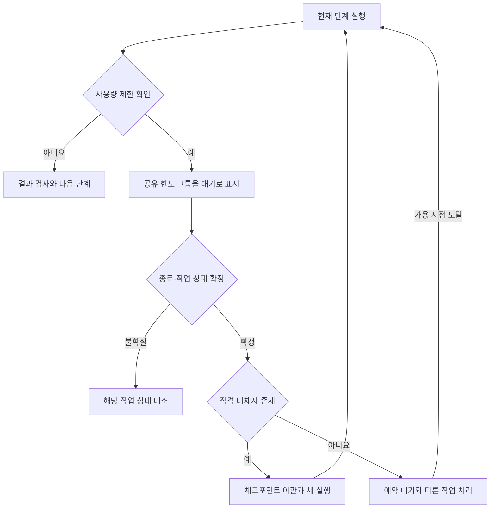

# 역할별 에이전트 자동 이관과 작업 흐름 유지

기준일: 2026-09-13, v1.0

상태: 사용자 요구사항을 반영한 후속 구현 계약. 이 문서는 기능 구현·실제 모델 호출·운영 검증 완료 보고가 아니다.

검토 기준: `feat/quota-auto-resume`, `e7ca36af3acfd9e92aa15cfde6201e2a0078cd28`

## 목표와 역할

사용자가 정한 구조는 Astra Ultra가 프로젝트 매니저와 최종 검수자를 맡고, Astra High와 Claude Code의 지정 Opus 설정이 개발과 1차 검수를 맡는 방식이다. 사용량 제한이 발생하면 등록된 가용 에이전트에 작업을 자동 이관한다. 대체자가 없을 때 기존 영속 대기·예약 재개 기능을 사용한다.

| 구성 | 책임 | 사용량 제한 시 처리 |
|---|---|---|
| 프로젝트 매니저: Astra Ultra | 목표를 작업·의존 관계·완료 조건으로 구체화하고 변경 판단 | 저장된 승인 계획의 실행을 계속하고, 새 판단이 필요한 작업은 대기 |
| 개발자: Astra High 또는 Claude Code | 현재 명세에 따라 코드·테스트 작성, 지적 사항 수정 | 허용된 다른 가용 개발자에게 체크포인트로 이관 |
| 1차 검수자: Astra High 또는 Claude Code | 현재 커밋과 명세·테스트를 대조하고 근거 있는 지적 제출 | 허용된 다른 검수 실행으로 이관. 작성 세션의 자기 승인은 금지 |
| 최종 검수자: Astra Ultra | 필수 검사와 미해결 지적을 확인하고 최종 판정 | 최종 검수 대기. 다른 독립 작업은 진행하되 승인 단계는 건너뛰지 않음 |
| 배정기: Python + SQLite + 기존 실행 감독 | 상태·가용성 조회, 배정·이관·예약·잠금·복구 | 모델을 호출하지 않고 계속 동작 |

`Claude Code Opus5 Ultracode`는 사용자가 지정한 구성 명칭으로 기록한다. 정확한 모델 ID와 추론 설정의 지원 여부는 서버 CLI 도움말·설정·실제 응답 메타데이터로 확인해 등록한다. 이 문서가 제품 명칭이나 지원을 보증하지 않는다. Astra도 각 실행의 실제 모델·추론 설정을 결과 메타데이터로 확인하며 목표 설정과 다르면 정상 실행으로 간주하지 않는다.

매니저와 최종 검수자는 같은 모델을 사용할 수 있지만 실행 역할·세션·입력은 구분한다. 최종 검수는 매니저의 완료 보고를 신뢰하는 대신 현재 후보 커밋과 검사 근거를 다시 확인한다. 1차 검수는 가능하면 다른 제공자에 배정하되, 사용량 상황에 따라 허용된 동일 제공자의 별도 검수 세션을 사용할 수 있다. 이 경우 교차 제공자 검수라고 보고하지 않는다.

## 흐름 유지의 의미

배정 판단을 Astra의 응답에 의존시키지 않는다. 매니저 호출 자체가 제한되어도 일반 프로그램이 이미 승인된 계획과 대체 정책을 읽어 계속 배정할 수 있어야 한다.

1. 적격 대체자가 있으면 사용자가 다시 지시하지 않아도 진행한다.
2. 특정 작업의 담당자가 모두 제한되어도 다른 실행 가능한 작업과 모델 호출이 필요 없는 검사를 진행한다.
3. 모든 필요한 제공자가 제한되면 큐·예약·상태 조회를 유지하고 최초 가용 시점에 재개한다. 모델 작업의 계속된 진척을 보장할 수는 없다.
4. 유일한 최종 검수자인 Astra가 제한되면 `WAITING_FINAL_REVIEW`에서 승인을 기다린다. 그 승인에 의존하는 후속 작업·병합 준비 판정을 진행하지 않는다.
5. 매니저가 제한된 동안 목표 확대, 완료 기준 변경, 새 권한·예산 추가를 하지 않는다. 이미 승인된 계획의 실행과 허용된 수정만 계속한다.

## 계정의 공유 한도와 적격 후보

에이전트 이름이나 세션 수가 사용량 자원의 수는 아니다. 같은 ChatGPT 계정에서 실행하는 Astra Ultra와 Astra High는 독립적인 예비 자원으로 취급하지 않는다. Work와 Codex의 사용량은 공유되며, 같은 제공자 안에서도 제한 범위가 계정·모델·요청 속도 중 어디인지 확인해야 한다.

에이전트 등록에는 `agent_id`, `provider`, `model`, `reasoning_effort`, `roles`, `capabilities`, `credential_ref`, `quota_group`, `enabled`를 둔다. 자격 증명 값은 등록 문서·프롬프트·로그에 넣지 않는다. 동일 계정·공유 한도의 세션은 같은 `quota_group`에 묶는다. 제한 범위를 확정할 수 없으면 같은 계정 그룹을 보수적으로 대기 처리한다.

예: 동일 OpenAI 계정의 `astra-pm`, `astra-developer`, `astra-final-reviewer`는 같은 공유 한도 그룹에 속할 수 있다. 이 그룹이 소진되었을 때 Claude의 등록된 자원이 가용하고 역할·권한 조건을 만족하면 개발을 이어간다. Claude 역시 가용성을 확인하며 무제한 자원으로 가정하지 않는다.

후보 선정 순서:

1. 작업 접수 때 고정한 역할별 허용 후보와 대체 순서에 포함되는지 확인한다.
2. 역할, 도구 기능, 저장소·파일 권한, 모델·추론 설정, 남은 예산을 확인한다.
3. 해당 후보의 공유 한도 그룹이 대기 중인지, 인증·환경 오류로 차단됐는지 확인한다.
4. 현재 작업 공간 소유권과 실행 동시성 조건을 확인한다.
5. 조건을 만족하는 후보를 결정적인 순서로 선택하고 선정 이유를 기록한다.

한도 경고만으로 작업을 중단하거나 제공자를 전환하지 않는다. 현재 파서가 허용하는 제공자 오류 이벤트·결과를 근거로 실제 제한을 분류한다. 모델의 일반 답변에 쓰인 "토큰 부족"이나 도구 출력의 문자열만으로 재배정하지 않는다. 인증·권한·샌드박스·결제·승인 오류를 사용량 제한으로 바꾸어 우회하지 않는다.

## 인수인계와 중복 실행 방지

같은 제공자·동일 세션을 다시 쓸 때는 저장된 명시적 `session_id`로 재개한다. 다른 제공자로 넘어갈 때는 새 세션에서 공통 인수인계 자료를 읽게 한다. Codex의 세션 ID나 비공개 대화·추론을 Claude 세션으로 그대로 이전할 수 있다고 가정하지 않는다.

인수인계 자료에는 다음을 포함한다.

- 불변 작업 명세·정책·역할별 허용 후보 목록의 버전과 해시
- 논리 작업 ID, 현재 단계, 현재 지적 목록, 마지막으로 검증된 완료 단계
- 저장소·작업 공간, 기준 커밋과 현재 HEAD, index·추적 파일 변경·허용된 미추적 파일의 목록과 해시
- 검증된 부분 결과와 아직 검증되지 않은 변경의 구분, 필요한 패치·파일 내용 참조
- 실행한 검사 명령과 결과·로그 참조, 이어서 해야 할 작업과 완료 조건
- 이전 제공자·세션·실행 ID, 중단 이유, 외부 커밋·PR 등 이미 발생한 작업의 근거

인수인계 기록은 한도 오류 직후 모델이 요약문을 써 줄 것이라는 전제 없이 만든다. 단계별 구조화된 기록과 디스크·Git 상태를 일반 프로그램이 수집한다. HEAD만 저장해서 미커밋 변경·새 파일을 잃어서는 안 된다. 해시는 검증용이며 필요한 파일 내용 자체를 대체하지 않는다. 비밀·인증 파일과 작업 범위 밖의 파일은 인수인계에서 제외한다.

이관 순서:

1. 기존 실행의 제한 사실을 기록하고 해당 한도 그룹을 대기로 표시한다.
2. 기존 프로세스와 하위 프로세스의 종료를 확인한다. 종료나 외부 작업 결과가 불확실하면 해당 작업만 `NEEDS_RECONCILIATION`으로 보낸다.
3. 확정된 작업 상태를 수집하고 이관 계획과 새 실행 세대를 영속 저장한다. 검토 대상 커밋과 실제 코드가 바뀌지 않았는지 확인한다.
4. 트랜잭션으로 논리 작업·단계의 활성 소유권을 새 실행으로 넘기고 이전 실행의 자동 재개 예약을 해제한다. 이전 세션 이력은 삭제하지 않는다.
5. 체크포인트를 전달해 대체 세션을 시작한다. 동일 작업 공간을 쓰려면 이전 실행의 종료와 잠금 소유권 이전이 확인되어야 한다.
6. 결과를 새 실행 ID·세대·정책 해시·후보 커밋과 대조한다. 이전 에이전트가 늦게 반환한 결과는 활성 결과로 채택하지 않는다.

실행 세대 검사는 오래된 결과의 채택을 막는 장치이며 이미 실행된 파일 쓰기나 외부 부작용을 되돌리지 않는다. 종료 확인, 작업 공간 잠금, 외부 작업 사실 대조를 함께 적용한다. lease 만료만으로 실행 종료를 가정하지 않는다.

현재 구현은 Git 공통 디렉터리의 잠금과 영속 실행 표식을 사용한다. 최초 이관 구현에서는 이 보호를 유지하고 같은 저장소의 실행은 직렬화한다. 다른 작업 공간에서 동시 쓰기를 허용하는 최적화는 별도 검증 뒤 적용한다.

## 상태와 식별자

아래 이름은 새 구현의 제안 계약이며 현재 CLI가 이미 제공하는 상태나 옵션이 아니다.

| 구분 | 상태 또는 필드 | 의미 |
|---|---|---|
| 한도 그룹 | `AVAILABLE`, `COOLDOWN`, `DISABLED`, `UNKNOWN` | 역할과 별도로 관리하는 공급자 자원의 가용성 |
| 논리 작업 | `READY`, `RUNNING`, `HANDOFF_PENDING` | 실행 준비·진행·이관 처리 |
| 논리 작업 | `WAITING_CAPACITY` | 해당 단계에 적격인 모든 후보가 일시적으로 불가용 |
| 논리 작업 | `WAITING_PM`, `WAITING_FINAL_REVIEW` | 지정된 판단자 또는 최종 검수자의 응답이 필요 |
| 논리 작업 | `NEEDS_RECONCILIATION`, `BLOCKED` | 외부 실행 상태 대조 또는 사람이 해결할 명확한 사유 |
| 실행 기록 | `execution_id`, `previous_execution_id`, `generation` | 같은 논리 작업 내의 실행 이력·늦은 결과 배제 |
| 세션 기록 | `provider`, `session_id`, `agent_id` | 제공자별로 독립적인 세션 식별 |

한도 그룹의 대기와 개별 작업 상태를 분리한다. 한도에 걸린 실행 기록의 `WAITING_QUOTA`는 보존하되, 작업이 대체자에게 이관된 뒤 그 이전 실행이 타이머에 의해 다시 시작되면 안 된다. 원래 제공자가 회복하면 후보 풀에 복귀하며, 진행 중인 대체자의 작업을 빼앗지 않는다.

대기시간은 실제 실행시간 예산에서 제외한다. 다만 공급자 전환으로 누적 비용·실행시간·코드 수정 횟수가 초기화되어서는 안 된다. 한도 재시도와 품질 문제의 수정 횟수는 서로 구분한다. 모두 제한된 경우 재배정 실패를 짧은 간격으로 반복하지 않고 제공된 reset 시각·여유 시간 또는 제한된 백오프를 사용한다.

`NO_ELIGIBLE_AGENT`와 `WAITING_CAPACITY`도 구분한다. 전자는 애초에 역할·권한·모델 조건을 만족하는 후보가 없는 구성 오류이고, 후자는 적격 후보가 일시적인 한도 때문에 기다리는 상태다.

## 기존 코드와 통합 범위

검토 기준 커밋에서는 `SessionSpec.provider`와 `agent_id`가 접수 시 고정되고, `SessionQueue`는 같은 세션을 예약 재개한다. 기존 개발 루프의 `Registry`는 역할마다 어댑터 하나만 등록하며 시뮬레이션 전용이다. 따라서 CLI 세션 큐에 대체자 선택만 붙여도 전체 개발·검수 루프가 자동화되었다고 판정할 수 없다.

구현은 다음 단위로 연결한다.

1. 역할별 후보 풀·가용성·공유 한도 그룹·대체 정책을 추가한다. 작업 접수에는 한 개의 고정 후보 대신 허용된 후보 집합과 대체 정책의 해시를 고정한다. 실제 선택은 실행 기록에 남긴다.
2. 논리 작업·단계와 제공자별 실행·세션을 연결하고 SQLite에서 소유권·예약을 일관되게 변경한다.
3. 기존 프로세스 감독·오류 분류·타이머를 재사용하여 이관을 실행한다. 배정·대기·재개 자체에 모델 호출을 요구하지 않는다.
4. 실제 세션 결과를 LangGraph의 구현 → 검사 → 1차 검수 → 수정 → 최종 검수 흐름과 연결한다. `SESSION_COMPLETED`는 해당 CLI 실행 완료일 뿐 최종 작업 완료가 아니다.
5. 최종 증적은 실제 현재 커밋, 명세·정책, 필수 검사, 미해결 지적, 지정된 최종 검수 결과에 묶는다. 모델·검수자를 임의 변경해 기존 작업을 통과시키지 않는다.

기존 세션·작업 바인딩을 제자리에서 덮어쓰거나 새 task ID를 발급해 한도를 초기화하지 않는다. 기존 대기 작업의 정책을 바꿔야 하면 사용자 요구사항에 따른 정책 버전 이행을 별도 이벤트로 기록하고 이전 정책·실행·누적 예산을 보존한다. 이행 전후의 상태·해시·예약 대조 절차를 문서화한다.

현재 유일한 최종 검수자는 Astra Ultra다. 다른 모델의 최종 승인 권한, 유료 API 예비 경로, 자동 병합·배포는 이 계약으로 추가되지 않는다. 그런 확장은 별도 정책·예산으로 정의한다.

## 완료 조건과 검증

가짜 CLI와 조정 가능한 시계로 아래 행동을 먼저 재현한다. 실제 한도 소진을 시험 조건으로 만들지 않는다.

| 사례 | 기대 결과 |
|---|---|
| Astra 개발 실행 제한, Claude 가용 | 같은 논리 작업이 Claude의 새 세션에서 체크포인트로 계속됨 |
| Claude 제한, Astra 가용 | 허용된 Astra 실행으로 이관되며 작업·정책·누적 예산 유지 |
| 동일 OpenAI 계정의 Astra High·Ultra | 계정 한도 제한 시 서로를 독립 대체 자원으로 선택하지 않음 |
| 양쪽 제공자 모두 제한 | `WAITING_CAPACITY`; 바쁜 재시도 없이 예약 유지·가용 시점 재개 |
| PM 제한 | 승인된 독립 작업은 계속되고 새 판단이 필요한 단계만 대기 |
| 최종 검수자 제한 | 1차 검수 성공으로 최종 승인을 대체하지 않음; 다른 독립 작업 진행 |
| 이관 뒤 원래 제공자 회복 | 기존 예약이 같은 작업을 중복 재개하지 않음 |
| 이관 트랜잭션·spawn·결과 저장 전후 강제 중단 | 재시작 후 실행·표식·소유권을 대조하고 중복 부작용을 차단함 |
| 이전 실행·하위 프로세스가 생존 | 대체 실행을 시작하지 않음; 다른 안전한 작업은 진행 |
| 이전 실행의 늦은 결과 | 세대·소유권 검사로 활성 결과 채택을 거부함 |
| 미커밋 수정·새 파일이 있는 중단 | 필요한 파일과 변경이 인수인계되고 외부 변경은 감지됨 |
| 세션 ID를 받기 전에 제한 | 확인된 미실행 또는 완전한 체크포인트·종료 근거가 있을 때만 새 실행; 그 외 상태 대조 |
| 인증·샌드박스 오류, 모델 본문의 한도 주장 | 사용량 failover로 오인하지 않음 |
| 컨텍스트 부족 | 한도 그룹을 소진 처리하지 않고 별도 체크포인트 인수인계 경로 적용 |
| 검수 반려·커밋 변경·필수 검사 누락 | 수정과 새 검증 요구; 한도 전환으로 검사·승인 단계를 건너뛰지 않음 |

이후 등록된 각 CLI에서 작은 실제 작업으로 모델·추론 설정, 세션 식별, 결과 형식, 권한, 프로세스 종료를 검증한다. 실제 호출을 수행한 시험과 모의 제한 시험을 구분해 보고한다. 정해진 후보·권한·예산 범위에서 개발 → 1차 검수 → 수정 → Astra 최종 검수까지 실제 연결된 근거를 확보해야 전체 흐름 구현 완료로 판정한다.

서버 구현 완료 보고에는 변경 커밋·PR, 정책과 DB 이행 방법, 위 시나리오 결과, 실제 호출 범위, 타이머 상태, 남은 차단 요인을 포함한다.

## 근거

- 사용자 지정 역할 구성과 사용량 부족 시 다른 가용 에이전트로 이어서 처리하라는 요구사항.
- [A급·OpenAI 사용량 공유 안내](https://learn.chatgpt.com/docs/pricing): Work·Codex의 사용량 공유, 작업에 따른 소비량 차이. 제공자의 정책·가용성은 바뀔 수 있다.
- [현재 대기·재개 구현 문서](https://github.com/HyungwonPark/ai-company/blob/e7ca36af3acfd9e92aa15cfde6201e2a0078cd28/docs/quota-resume.md).
- [현재 세션 계약](https://github.com/HyungwonPark/ai-company/blob/e7ca36af3acfd9e92aa15cfde6201e2a0078cd28/src/ai_company/sessions.py)과 [기존 하네스](https://github.com/HyungwonPark/ai-company/blob/e7ca36af3acfd9e92aa15cfde6201e2a0078cd28/src/ai_company/harness/__init__.py).

최종 수정일: 2026-09-13, v1.0
