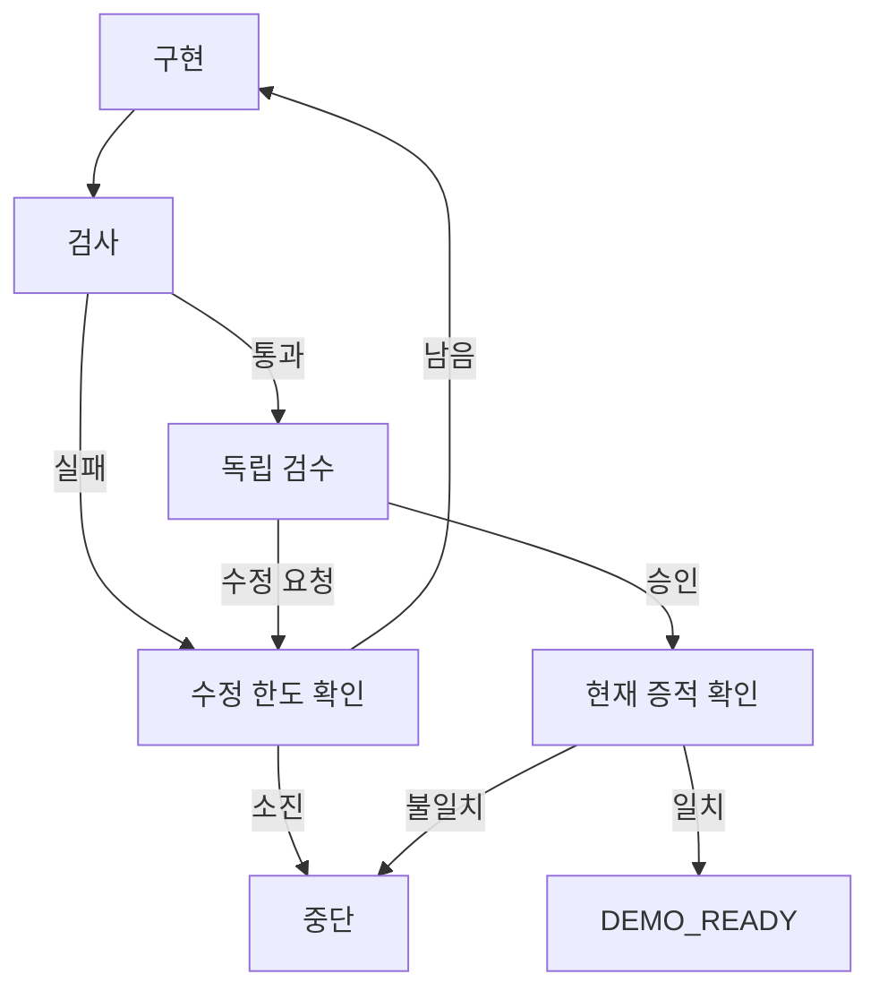

# 첫 하네스·루프 구현

기준일: 2026-09-13, v0.1 기반 구현

하네스와 루프를 모두 이 저장소의 코드로 구현한다. 이 문서의 개발 루프는 가짜 어댑터이며 실제 모델·Git·GitHub를 호출하지 않는다. 이후 추가된 실제 CLI 세션 큐는 [사용량 제한 대기·재개 문서](quota-resume.md)에 별도로 설명한다. 세션 큐의 `SESSION_COMPLETED`를 이 루프의 검사·검수 통과로 연결하지 않는다.

## 책임 분리

| 경로 | 책임 |
|---|---|
| `src/ai_company/contracts.py` | 작업, 정책, 맥락, 검사, 실행 결과의 불변 규격 |
| `src/ai_company/harness/` | 역할별 어댑터 선택, 맥락 조립, 작업 공간, 실행 식별, 결과 검증 |
| `src/ai_company/adapters/` | healthcheck/start/status/cancel/collect 공통 계약과 가짜 실행기 |
| `src/ai_company/runtime.py` | 제한 시간 내 상태 조회, 종료 확인, 불확실한 실행 구분 |
| `src/ai_company/workflows.py` | LangGraph의 단계·분기와 완료 판정 |
| `src/ai_company/storage.py` | 접수 내용 고정, 실행 사실, 단일 조정기 파일 잠금 |

이 첫 구현은 작은 모듈로 시작한다. 실제 CLI·GitHub 통합이 늘어나면 계획의 `runtime/`, `policy/`, `integrations/` 구조로 분리한다.

각 역할은 다른 실행 ID·작업 공간을 받는다. 검수자는 같은 작업 명세와 현재 후보 커밋·검사 결과·미해결 지적을 받는다. 수정 담당에게도 지적 ID와 근거를 전달하며, 다음 검수가 해결 근거를 제출해야 지적을 닫는다. 검수자 출력은 실행 ID·맥락 해시·역할·후보 커밋에 결합된다.

새 실행 도구는 공통 어댑터 계약을 구현해 `Registry.register()`로 역할에 연결한다. 같은 역할을 다른 제공자로 교체해도 흐름 노드를 고치지 않는다. 실제 어댑터를 넣기 전에는 시뮬레이션 전용 계약을 확장하고 도구·인증·권한 정책을 별도로 검증해야 한다.

## 체크포인트와 실행 사실

LangGraph 체크포인트는 작업 흐름을 저장한다. [A급·LangGraph 상태 저장 공식 문서](https://docs.langchain.com/oss/python/langgraph/persistence)

외부 작업의 재실행 위험은 별도의 실행 기록으로 처리한다. 이 시뮬레이터에서는 다음 경계를 검증한다.

1. 하네스가 실제 어댑터를 호출하기 전에 `running` 실행 사실을 커밋한다.
2. 어댑터의 결과를 검증하고 `completed` 사실을 커밋한다.
3. 이후 LangGraph가 노드 결과를 체크포인트에 저장한다.
4. 2~3 사이에 중단되면 저장된 결과를 재사용해 흐름만 이어간다.
5. 1~2 사이에 중단되면 `NEEDS_RECONCILIATION`으로 멈추고 같은 실행을 새로 시작하지 않는다.

이는 외부 시스템의 정확히 한 번 실행을 보장한다는 뜻이 아니다. 실제 CLI 연결 후에는 프로세스·하위 프로세스·원격 커밋·PR을 조회하여 불확실한 사실을 확인하는 복구 도구가 필요하다. 현재 버전은 불확실한 실행의 자동 재개 기능을 제공하지 않는다.

하나의 상태 경로를 사용하는 조정기는 파일 잠금으로 1개만 허용한다. 서로 다른 상태 경로·호스트 간 중복 방지는 아직 구현하지 않았다. 이 SQLite·파일 잠금 구성은 단일 Linux 호스트 시험용이다.

## 완료와 중단

| 상태 | 의미 |
|---|---|
| `RUNNING` | 진행 중 또는 시험용 체크포인트에서 일시 정지 |
| `DEMO_READY` | 모의 구현·검사·검수 근거가 일치함. 실제 병합 준비와 구분 |
| `STOPPED` | 수정 횟수 한도 소진 |
| `BLOCKED` | 잘못된 결과·명세 변경·누락 검사·환경 오류·시간/실행 횟수 한도 등 |
| `NEEDS_RECONCILIATION` | 이전 실행의 종료 또는 결과를 확인하지 못함 |

작업 명세, 정책, 에이전트 이름·버전·설정과 흐름 버전을 작업 ID에 고정한다. 같은 ID로 바뀐 조건을 접수하지 않는다. 작업 시간은 최초 접수부터 계산하여 재시작으로 초기화되지 않게 한다. 완료 결과를 다시 조회할 때도 모의 head/base 변경을 확인한다.

## 실제 실행 전 남은 검증

- 작업별 코드는 아직 체크아웃하거나 수정하지 않는다. 모의 커밋은 결정적으로 생성한 식별값이다.
- 검사 서비스는 독립된 가짜 제공자이다. 실제 GitHub head/base/tested 커밋과 필수 검사 정책 확인이 필요하다.
- 경로 형식 검사와 작업 공간 생성은 구현했지만 OS 권한·네트워크·도구 제한을 제공하지 않는다. 시뮬레이션 계약이 실제 프로세스 어댑터를 허용하지 않는다.
- 취소 확인은 가짜 어댑터 계약으로 시험한다. 실제 프로세스 그룹 종료·PID 재사용·서버 재시작 복구를 검증해야 한다.
- 현재 실행 한도는 시간·수정·호출 횟수이다. 실제 모델 비용·사용량 상한은 CLI 인증 방식 확인 후 추가한다.
- 배포·DB 마이그레이션·로그 보존·백업·다중 서버·작업 대기열은 후속 단계이다.

잠긴 의존성과 같은 테스트 명령을 CI에서도 사용한다. 모의 통과를 실제 운영 검증으로 보고하지 않는다.
