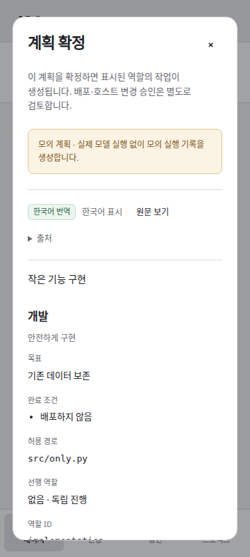
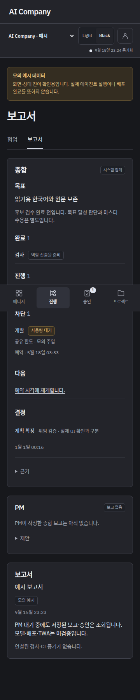

# 실사용 연결 현황 · 2026-09-16

최신 공개 웹은 별도로 승인받은 **`28404b2` 적용 완료**이며 [현재 화면·APK 조작·복구 결과](pr12-web-activation-2026-09-16.md)를 따른다. 두 worker와 Claude 설정의 기준은 [승인된 `5594744` 적용 결과](production-activation-2026-09-16.md)다. 웹·두 worker·Claude 개발 대체 후보를 한 번 교체했고, 제한된 번역 복구는 4건 반영·2건 오탐 차단으로 종료했다. 아래 이전 적용 대기 기록은 각 시점의 기록으로 보존한다.

후속 [상시 worker 활성화·상위 구축 목표와 앱 검증 분리](worker-activation-2026-09-16.md)를 적용했다. 아래 worker 활성화 전 표시는 준비 당시의 기록이다. 외부 서명키 백업은 worker 연결과 독립적으로 진행한다.

최신 웹 화면은 `https://hyungwon.cloud`에 적용했다. 실제 마스터의 새 목표 입력·계획 확정과 그 실행의 끝까지 대조는 아직 진행하지 않았다. 아래 검사를 전체 자동 운영 완료로 해석하지 않는다. PR #10 후보 승인은 `pending`으로 보존했다.

이름·자연어 목표로 시작하는 [PM 작업실](human-workspace-ux-2026-09-16.md)과 [기존 번역 실패 6건의 복구안](translation-repair-2026-09-16.md)은 `c2b3fec`에서 준비한 이력이다. 작업실은 현재 `5594744`로 적용됐고 번역 6건도 승인 범위만 실제 처리했다. 새 [프로젝트 탐색·실제 상태 안내](pr12-ux-validation-2026-09-16.md)는 후보 `28404b2`의 구현·원격 CI·독립 검수·웹 패키지 준비를 마쳤으며 별도 사용자 승인 후 **공개 적용까지 완료**했다.

후속 [Claude 실제 적용 설정·동적 Workflow](claude-runtime-settings-2026-09-16.md)와 [격리 개발 이관·같은 세션 재개](claude-dispatcher-2026-09-16.md)를 별도 큐에서 확인했다. 시험 당시에는 운영 대체자를 활성화하지 않았지만 현재는 승인된 `5594744` 설정을 적용했다. 새 앱 실행의 전체 검수는 마스터 입력 대기다. 아래 과거의 effort·이관 미확인 기록은 당시 기록으로 보존한다.

## 현재 상태

| 항목 | 완료·차단과 다음 행동 |
|---|---|
| 공개 화면 | 승인한 `5594744` 웹 적용 완료. `c2b3fec` 별도 교체 없음. PR #12 후속 UX `28404b2`도 별도 승인 후 웹 적용 완료. 두 worker는 `5594744` 유지 |
| 상시 실행 | 자동화·번역 두 서비스 enabled/active. 중복 거부·중단 후 복구 검증 완료, 실제 호스트 재부팅은 미실시 |
| 번역 | 원래 실패 6건 보존. 새 복구 산출물 4건 완료·2건 보호검사 오탐으로 실패, 추가 호출 4회·재예약 없음 |
| Claude | `5594744` 개발 대체 후보 설정 활성화 완료. 별도 시험의 이관·재개·읽기 검수와 앱의 새 실제 실행은 구분. 기존 격리 제한 유지 |
| 마스터 검증 | 새 APK 목표 입력·계획 확정을 대행하지 않음. 실제 클릭 후 동일 실행의 개발·검수·보고·승인 요청 대조 필요 |
| 실행 범위 | 첫 앱 검증은 두 pilot 파일과 기존 CI 메타데이터만 허용. 서버 구축 목표와 임의 프로젝트 자동 개발은 별개 |
| 서명키 | 서버 암호화본·로컬 복원 검사 완료. PC 외부 보관과 별도 비밀번호 관리자 저장·외부 복원 확인 필요 |
| 기존 운영 | 커플 서비스·기록·기존 타이머·PR #10 `pending` 유지. 병합 없음 |

이 표가 최신 상태이며, 아래 기능·활성화 전 절차와 이전 검사 수치는 각 시점의 기록이다. PM이 작성한 목표 종합 평가는 아직 없고 현재 종합 보고의 출처는 시스템 집계다.

## 반영한 기능

- 계획 상세·확정에 역할명, 담당 범위, 목표, 완료 조건의 읽기용 한국어를 연결했다. 경로·역할 ID·의존 관계·원문·원본 계획 digest는 그대로다. 확정 화면에서 읽은 번역의 source digest와 artifact ID를 기록하고, 다른 원문/변조된 번역은 거부한다. 원문 전환 시 확인 체크를 초기화한다.
- 보고서의 **종합**은 현재 목표 revision → 계획 digest → 실행 ID에 속한 작업의 완료·진행·차단 원인·예약·다음 행동·결정·후보 근거를 집계한다. 개발 역할의 완료를 전체 목표 달성으로 취급하지 않는다. **PM**은 별도 출처이며, PM이 쓴 종합 보고가 없으면 없다고 표시한다. 시스템 집계 문장을 PM 작성물로 표시하지 않는다.
- 매니저의 **상세 → 운영**에서 자동화(PM·조정기)와 번역 worker의 heartbeat를 표시한다. 20초가 지나면 오래된 상태로 구분한다. 컨테이너가 호스트 PID를 직접 확인했다고 주장하지 않는다.
- 짧은 화면 제목과 Light·Black을 유지했다. 새 화면 모듈을 오프라인 shell에 포함했다. API 응답·계정·승인 정보는 service worker 캐시에 넣지 않는다.

## 검증 근거

아래는 초기 `51b911a` 당시 기록이다. 현재 적용 결과와 최신 미적용 후보의 검사는 위 문서 링크로 구분한다.

기능·운영 이미지 기준 커밋은 `51b911a68d8c6341a8a93ce90ec6b8a627ab2df5`다.

| 검사 | 결과와 한계 |
|---|---|
| [Python CI](https://github.com/HyungwonPark/ai-company/actions/runs/35035425533) | Python 3.11·3.12 각각 **298개 PASS**, Android 준비 각각 4개 PASS |
| [UI CI](https://github.com/HyungwonPark/ai-company/actions/runs/35035425544) | 한국어 계획·확정 payload·원문 전환·stale 번역 거부·종합 보고·Light/Black·모바일·오프라인 재열기 PASS |
| 계획 API | 원래 digest/하네스 유지, 번역 참조 감사, 재요청 시 실행 1건, 변조 시 실행 없음 |
| worker 테스트 | SIGKILL 후 flock 해제, 다른 component 독립 소유권, 오래된 boot/heartbeat 판별, graceful 종료 |
| 실제 사용자 systemd | 별도 임시 큐·가짜 tick으로 한 worker 정지 중 다른 worker 완료, 동일 worker 중복 거부, SIGKILL 뒤 새 PID로 자동 재시작 1회 PASS. 테스트 서비스는 모두 제거 |
| 사용량 대기 복구 | 실제 호스트의 가짜 CLI·새 큐에서 WAITING_CAPACITY → 저장된 세션 resume → READY. 실행 2회. 실제 계정 한도를 소진하지 않음 |
| 새 이미지 격리 검사 | 네트워크 없음·읽기 전용 root·capabilities 없음·운영 state 미연결 상태에서 파일 27개, 비인증 API 거부, 잘못된 Host 거부, 비밀번호 로그인 방식 PASS |

실제 호스트 재부팅은 수행하지 않았다. 기존 회귀에는 PR #5의 WAITING_QUOTA/WAITING_RETRY 중단 경계와 미승인 workflow 증적 거부가 포함된다. 위 모의 대기 복구를 실제 Claude 계정 간 이관으로 보고하지 않는다.

UI 증적은 workflow ID `357711638`, 경로 `.github/workflows/console.yml`, run `35035425544`, attempt `1`, 위 head commit과 연결된다. `console-screenshots` artifact `10423575097`의 GitHub digest는 `sha256:4bb9735e26e6baadeb8d33cf3f505b21db975c666c27455a2128ee0649af0473`다. [선택 화면과 파일 digest](assets/live-use-2026-09-16/manifest.json)는 인증된 격리 서버의 응답 예시다. 실제 마스터 조작 증거가 아니다.

| 계획 | 종합 보고 |
|---|---|
|  |  |

## 공개 적용·복구

이 절은 초기 `51b911a` 이미지 교체 이력이다. 현재 운영과 복구 기준은 [5594744 적용 결과](production-activation-2026-09-16.md)를 따른다.

당시 사용자 요청의 “기존 승인 범위를 확인해 공개 적용을 진행”에 따라 관리 UI 이미지 하나를 교체했다. 새 모델 작업·계획 확정·후보 수용은 수행하지 않았다.

| 항목 | 고정값 |
|---|---|
| 현재 이미지 | `sha256:0b335d24f67c3a727a366b63879165ea2b8ef54323cbb5ca267b4d050cb3aaed` |
| 복구 이미지 | `sha256:ddb2145c5557e4170c537b825b591d36c318544a28f140c93f59fc89ea31f528` |
| 변경 | 기존 Compose의 `services.console.image` 한 필드 |
| 기존 Compose SHA-256 | `687a7c1003a4cdfd703aa10c89e7e4d81476443a3a3fcdea751d6dd5acfd66c1` |
| 적용 기록 | 서버 `.ai-company/live-use-20260916/applied.json` |
| 원래 설정 백업 | 같은 폴더 `compose.approved-backup.json` |

HTTPS 파일 27개의 SHA-256, 로그인 방식, 비인증 API 401, assetlinks 동일성을 확인했다. 계정과 기존 논리 기록 14개 테이블의 digest가 적용 전후 같았다. 커플 앱·Caddy·DB·백업 컨테이너의 ID/PID/시작 시각/재시작 횟수, Caddy 설정, 기존 quota timer가 유지됐다.

복구는 현재 Compose가 이번 제안과 같고 현재 컨테이너가 위 새 이미지인지 먼저 확인한 뒤, 백업한 Compose를 돌려놓고 `docker compose -f <기존 console.compose.json> up -d --no-build --no-deps console`만 실행한다. 그 후 HTTPS·기존 서비스·기록을 재대조한다. 다른 변경이 발견되면 덮어쓰지 않는다. 운영 DB와 새 기록은 과거 백업으로 되돌리지 않는다. 추가된 읽기용 테이블은 이전 이미지 복구 시에도 보존한다.

## 상시 worker 적용안 · 활성화 전

현재 PM·조정기·번역 상시 worker는 가동되지 않는다. 기존 `ai-company-quota.timer`만 active이며 사용자 linger는 이미 `yes`다. 다음 **두 새 user service의 enable/start**는 이전의 서비스 운영 제외 경계와 구분해 추가 확인한다. 준비와 검증만으로 활성화하지 않았다.

- `ai-company-automation.service`: PM과 조정기, 기존 정책에 따른 최대 두 독립 역할 실행.
- `ai-company-translation.service`: 기존 Claude 로그인으로 경량 Haiku 읽기용 번역. PM 대기·실패와 독립된 서비스.
- [unit 원본](../deploy/systemd/ai-company-automation.service), [번역 unit](../deploy/systemd/ai-company-translation.service), [충돌 거부·적용·중지 스크립트](../scripts/install_control_plane_workers.py).

준비 경로는 서버 `.ai-company/live-use-20260916/worker-proposal`이다. `manifest.json`이 unit 2개·설정 2개·환경 경로 1개의 SHA-256을 고정한다. 별도 release `/home/edward/ai-company/releases/control-plane-51b911a`에 잠금 의존성과 비편집 설치를 완료했다. 설치 시 새 `releases/control-plane` 링크와 `runtime/control-plane`만 만들며 기존 파일·unit·계정 매핑이 있으면 덮어쓰지 않고 중단한다. 준비된 경로로 치환한 unit의 `systemd-analyze --user verify`와 적용 스크립트의 읽기 전용 사전 검사는 통과했다.

자동화 설정은 기존 설정을 그대로 복사했다. 정규화 digest는 `e65c1459c90ba0fa313242bd908a02431e6f0bb9255f0e849053beab4edaa972`다. base `e4eb29dd62ded0e587b35a3eab6d35f4c2b44529`, 허용 파일 `src/ai_company/pilot_status.py`와 `tests/test_pilot_status.py`, CI 요청 메타데이터, 기존 검사·독립 검수·Astra Ultra 최종 검수·출처 규칙을 유지한다. 임의 프로젝트 개발까지 허용된 설정은 아니다. 이전 실행의 정책을 바꿔 합격시키지 않는다.

번역은 `claude-haiku-4-5-20251001`, CLI `2.1.270`, 요청 effort `low`, 도구·MCP 없음이다. 실제 적용 effort/Ultracode는 여전히 미관측이다. 한 호출 최대 60초·CLI 비용 상한 $0.05, 한 문서 최대 두 시도·총 120초다. 종료가 확인된 실행만 두 번째 시도가 가능하고, 종료 불명은 재실행하지 않는다. 기존 계정의 공유 한도를 등록하기 위해 새 `claude → pilot-local-claude` 매핑/한도 행 각 하나를 만든다. 기존 Codex 그룹이나 cooldown은 바꾸지 않는다. 번역이 권한·원문·승인을 바꾸지 않는다.

서비스는 실패 시 15초 후 재시작, 10분 내 5회 시작 제한, flock으로 동일 component 중복 방지, 영속 큐와 실행 식별자로 복구한다. graceful 종료 후 남은 자식은 cgroup 단위로 정리한다. 중지는 제안 디렉터리에 대해 적용 스크립트의 `--rollback`을 사용한다. 설치 당시와 같은 unit/설정만 제거하며, 실제로 저장된 실행·사용량·계정 매핑은 감사와 공유 한도 보존을 위해 남긴다. 기존 타이머·커플 서비스·공개 Caddy·PR #10은 변경하지 않는다.

## Claude 대체 적격성

[실제 제한된 탐색 결과](evidence/claude-eligibility-2026-09-16.json): 기존 로그인, 도구 없는 1회 호출, `claude-opus-5`, 요청 `xhigh`, 성공, CLI 기록 비용 $0.024285, 종료된 cgroup을 확인했다. CLI initialize는 xhigh 지원을 알렸지만 실제 적용 effort/Ultracode 메타데이터는 없었다. 모델의 자기 설명을 근거로 쓰지 않았다.

현재 `cli_configuration` 정책은 Codex rollout/turn의 모델·effort 증거만 판정한다. 따라서 **Claude의 자동 대체 적격성은 false**다. 실제 Claude 이관·예약 재개는 미검증이며, 기존 정책을 완화하거나 verified 값을 임의로 채우지 않았다. [공식 CLI 옵션 문서](https://code.claude.com/docs/en/cli-reference)는 요청 옵션의 근거이고 적용 결과의 근거가 아니다. Ultracode·동적 workflow 동작도 검증 완료로 표시하지 않는다.

## APK에서 마스터가 수행할 단계

상시 worker 활성화가 확인된 다음 실제 마스터가 수행한다. 이전 위임을 재사용하지 않는다.

1. [APK 0.1.1](https://github.com/HyungwonPark/ai-company/releases/download/android-v0.1.1/ai-company-0.1.1.apk)을 열고 `edward`와 기존 비밀번호로 로그인한다. 비밀번호를 초기화하지 않았다. 화면이 오래됐으면 앱을 완전히 닫았다가 온라인에서 다시 연다.
2. **프로젝트**에서 새 검증 프로젝트를 만들고 아래의 제한된 한국어 목표를 입력한다. PR #10이 있는 이전 실행을 수정하지 않는다.
3. **매니저**에서 실제 PM 제안을 기다린다. 개발·검사 두 역할, 허용 파일, 하네스와 완료 조건을 확인한다. 이때 개발 실행은 아직 없어야 한다.
4. 읽은 계획의 **계획 확정**을 직접 누른다. 후보 수용·배포·병합 승인이 아니다.
5. 서버는 목표 revision·plan digest·직접 확정 이벤트·새 run ID 1개를 대조한다. 새로고침 후에도 같은 실행인지 확인하고, 두 독립 clone의 진행 → 같은 후보의 검사 → 원격 CI → 독립 검수 → Astra 최종 검수 → 종합 보고·후보 승인 pending까지 연결한다. 수정 요청은 해당 역할로 반환한다.

제안하는 입력 목표:

> 역할 상태를 집계하는 `summarize_role_states(states: Mapping[str, str]) -> dict[str, int]`를 만듭니다. 개발 역할은 `src/ai_company/pilot_status.py`, 검사 역할은 `tests/test_pilot_status.py`만 담당합니다. 반환 키는 `active`, `waiting`, `blocked`, `done`, `unknown`이며 항상 다섯 키를 포함합니다. 같은 이름의 소문자 상태를 해당 키로 집계하고 나머지는 `unknown`으로 셉니다. 빈 입력, 모든 분류, 알 수 없는 상태, 입력 불변을 독립 검사합니다. 두 역할은 이 계약으로 병렬 진행합니다. 기존 격리 검사·원격 CI·독립 검수·Astra Ultra 최종 검수를 적용하고 배포·병합은 하지 않습니다.

현재 새 실제 UI 확정은 **0건**이다. 설치·실행·로그인·뒤로가기·테마·승인 화면의 실기기 결과는 이 조작 후 따로 기록한다. 이전 에뮬레이터 실행 검사와 웹 CI를 휴대폰 검증으로 대체하지 않는다.

## 서명키·인수인계

- 앱 ID `cloud.hyungwon.aicompany`, 버전 `0.1.1`(2), 주소 `https://hyungwon.cloud`. APK SHA-256 `a48bb5642ab676203f56051fe8647c802a7dcbec4f6d78eaa8c351902088992c`.
- 실제 APK 인증서와 공개 `/.well-known/assetlinks.json` 연결은 기존 기록대로 유지했다. 이번 웹 배포 전후 assetlinks가 같았다. 커플 앱 키와 분리돼 있다.
- 원본 키는 서버 사용자 전용 `~/.local/share/ai-company/android-signing`에 있다. Git·공개 릴리스·로그에 키나 비밀번호를 올리지 않았다.
- **암호화본 준비와 서버 내 복구 검사는 완료**했다. OpenPGP AES256으로 키·저장소 암호·공개 인증서를 묶었고, 복구 코드는 별도 파일에 보관했다. 메모리에서 복호화한 바이트가 원본과 같고, keystore가 열리며 개인키가 유효하고 실제 APK 인증서와 대응함을 확인했다. 잘못된 복구 코드와 손상된 암호문은 거부됐다. 원본 파일은 변경하지 않았으며 평문 복사본을 디스크에 쓰지 않았다. [검사 영수증](evidence/signing-backup-preparation-2026-09-16.json)
- **서버 외부 보관·외부 기기 복구는 미완료**다. 보관 위치 선택을 요청했다. 아래 암호화본과 복구 코드를 지정된 사적 경로로 전달한 뒤 확인해야 한다. 같은 서버의 암호화 복사본을 외부 백업으로 세지 않는다.

암호화본의 서버 경로는 `~/.local/share/ai-company/android-offsite-preparation/20260915T234537Z-ec4b9fa3/ai-company-signing.tar.gpg`다. 10,315바이트이며 SHA-256은 `d18f7fe187ff50961b6dd1ab7321546f51a8761cdeced7b97871e639e31e5f93`다. 디렉터리는 0700, 암호화본과 별도 복구 코드 파일은 0600이다. 암호화본도 공개 GitHub 릴리스에 게시하지 않았다.

외부 인수자는 다음을 기록한다.

1. 개인 저장소에 암호화본을 저장하고 위 SHA-256과 비교한다. 별도 복구 코드는 비밀번호 관리자 등 다른 안전한 위치에 둔다.
2. 별도 안전한 기기에서 접근 제한된 임시 폴더를 만들고 GPG의 암호 입력창을 사용해 복호화한다. 복구 코드를 명령 인수·셸 기록에 넣지 않는다.
3. 복원한 PKCS12와 함께 복원한 `store-password`로 keystore를 연다. 공개 인증서 SHA-256이 `E0:22:C4:1F:03:95:9B:51:54:C0:85:8C:22:F7:25:EF:49:D0:B1:F6:2F:DB:39:92:64:0F:30:86:E6:2E:98:79`인지 확인한다.
4. 외부 보관 위치·담당자·검사 시각·일치한 공개 지문만 인수인계에 남긴다. 평문 임시 파일은 제거하고 키·암호를 Git·공개 로그에 남기지 않는다. 서버 원본과 기존 APK 서명은 교체하지 않는다.

최신 완료·차단·다음 행동은 문서 앞의 **현재 상태**를 따른다. 활성화 전 절차와 과거의 미확인 표시는 당시 기록이며, 이미 완료한 worker 활성화를 남은 작업으로 다시 세지 않는다.
