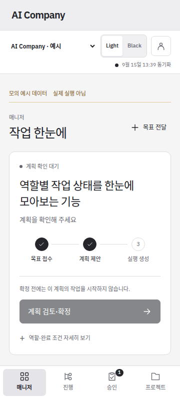
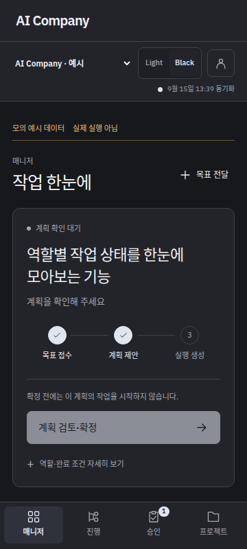

# 모바일 매니저 화면 정리·검증

2026-09-15. 긴 영어 대화가 화면을 차지하던 매니저를 **목표 → 현재 단계 → 다음 행동 → 역할별 상태** 순서로 정리했다. 구현과 검증은 완료했으며 공개 관리 UI의 교체는 아직 적용하지 않았다.

| Light | Black |
|---|---|
|  |  |

[Light 전체 화면](assets/manager-readable-2026-09-15/light-mobile-manager-simple.png) · [Black 전체 화면](assets/manager-readable-2026-09-15/black-mobile-manager-simple.png) · [데스크톱](assets/manager-readable-2026-09-15/light-desktop-manager-simple.png)

위 캡처는 실제 브라우저에서 촬영한 **인증된 격리 서버의 응답 예시**다. 한글 문구는 화면 검사에 사용한 예시이며, 이번에 실제 PM·번역 모델이 생성한 결과로 보고하지 않는다. 기존 운영 기록을 바꾸거나 계획·후보 승인을 제출하지 않았다.

## 화면 변경

- 처음 열면 매니저의 현재 작업이 보인다. 목표 제목과 목표 접수·계획 제안/확정·실행 생성의 세 단계를 표시한다. 실제 기록이 있을 때만 단계 표시를 채운다. 임의의 완료율은 만들지 않는다.
- 최신 요청 버전의 계획과 같은 계획 digest의 실행을 연결한다. 다른 계획의 성공이나 이전 실행을 현재 계획의 진행으로 표시하지 않는다. 후보와 연결된 승인 요청이 있을 때만 그 요청 확인을 다음 행동으로 올린다.
- 현재 세션의 사용량 대기가 먼저 저장되면 배정기의 이전 실행 요약보다 실제 역할 상태를 우선한다. 요청 모델과 관측된 모델을 구분하고, 배정이 없으면 미배정으로 표시한다. 병렬로 시작 가능한 역할 수는 계획의 의존 관계로 계산한다.
- 긴 대화·원문·설정·이전 계획은 기본으로 접는다. 원문은 그대로 펼칠 수 있다. 계획 확정 대화상자의 전체 역할·허용 경로·완료 조건과 기존 digest·멱등성·CSRF 검사는 유지한다.
- 모바일 상단 설정은 계정 메뉴로 모으고 하단 메뉴에는 아이콘을 사용한다. 320·360px에서 다음 행동 버튼이 하단 메뉴에 가려지지 않는지 검사했다. 테마 전환·재연결에도 입력은 보존한다.

## 한글 표시와 권한

기존 번역 역할에 프로젝트 목표와 계획의 짧은 설명·역할명을 읽기용 문서로 연결했다. 계획 전체 내용과 digest는 보호 필드에 보존한다. 번역이 없으면 긴 영어 문단을 첫 화면의 제목으로 노출하지 않고, 역할 수·완료 조건 수 같은 실제 구조화된 사실을 표시한다. 번역 대기 상태와 원문은 상세에서 확인할 수 있다. 기존 영어 문서 전체의 실제 번역 완료를 주장하지 않는다.

새 PM 실행 명세를 만들 때 사용자에게 보이는 설명·역할명·완료 조건을 간결한 한글로 작성하도록 지시한다. 경로·명령·식별자·제약은 그대로 유지하며, 이미 저장된 실행 명세를 바꾸지 않는다. 이번 검증에서 PM·번역 worker를 새로 실행하지 않았다.

문서 종류를 늘리면서 드러난 승인 번역 연결 회귀도 수정했다. 승인 검사는 문서 배열의 첫 항목을 사용하지 않고 **해당 승인 ID의 원본 문서**를 선택한다. 원문·번역 digest 대조와 과거 번역을 통한 감사 기록은 계속 검사한다. 재로그인 시 이전 계정 메뉴의 펼침 상태가 복원되던 문제도 수정했다.

## 검증 근거

앱 소스는 `515274247d801ab568eef1f1a85f8176cadd31e4`다. 브라우저 검사 요청의 PR head는 `074dd96241bd8affe3c053212ee43de859e89c96`이며 두 커밋 사이의 앱 소스·의존성에는 차이가 없다.

| 검증 | 결과 |
|---|---|
| 전체 Python 회귀 | 로컬 287개, [Python 3.11·3.12 원격 CI](https://github.com/HyungwonPark/ai-company/actions/runs/34976392029) PASS |
| 문서·승인 연결 | 원문·보호 필드 보존, 원문 변경 후 번역 무효화, 기존 승인 감사·멱등성 회귀 PASS |
| 화면의 상태 집계 | 현재 요청/계획 digest, 실제 세션 대기, 의존 역할 수, 다른 후보 승인 제외, 원본 불변 PASS |
| [Console UI CI](https://github.com/HyungwonPark/ai-company/actions/runs/34976391985) | Light·Black, 320/360px, 첫 화면 버튼 위치, 원문 접기/펼치기, 입력 보존, 번역 대기 중 탐색, 새 메뉴의 로그아웃·재로그인·비밀번호 변경, 기존 계획·승인·이관·오프라인 회귀 PASS |
| CI 캡처 출처 | workflow 경로·ID·run head·artifact 소속과 ZIP digest 대조 PASS. [원본 PNG 해시](assets/manager-readable-2026-09-15/manifest.json) 보존 |
| 최종 후보 컨테이너 | 웹 파일 25개와 실제 HTTP 내용 해시, 비밀번호 로그인 모드, 인증 없는 API 거부, 다른 Host 거부 PASS |
| 격리 | 일회성 컨테이너의 네트워크 없음, 공개 포트 0, 읽기 전용 root, capability 제거, 권한 상승 금지. 운영 상태·자격 증명 마운트 없음 |

같은 PR head의 [Android APK CI](https://github.com/HyungwonPark/ai-company/actions/runs/34976391922)와 [기존 공개 HTTPS 검사](https://github.com/HyungwonPark/ai-company/actions/runs/34976392097)도 통과했다. 이 HTTPS 검사는 기존 공개 서비스의 연결 검사이며 새 후보의 배포 증거가 아니다.

Android 앱과 서명키는 변경하지 않았다. 공개 웹 반영이 승인되면 기존 APK에서 갱신된 화면을 사용하며 APK 재설치는 필요하지 않다. 실제 휴대폰에서 새 웹 UI가 보이는 결과는 공개 반영 후 별도로 확인한다.

## 검토할 공개 적용안

변경은 기존 Compose의 **`services.console.image` 한 필드**와 해당 관리 UI 컨테이너 교체 한 건이다. 기존 PR #8에 준비한 B형 협업·한글 문서 표시와 이번 매니저 정리가 포함된다. worker를 재시작하거나 번역을 자동 활성화하지 않는다.

| 항목 | 값 |
|---|---|
| 이전 운영 이미지 | `sha256:ddb2145c5557e4170c537b825b591d36c318544a28f140c93f59fc89ea31f528` |
| 검사한 후보 이미지 | `sha256:99719e99d6cdc5f42d75fd12a866d5ec40df4d3031a625b7b4b7028504121149` |
| 적용 전 Compose SHA-256 | `687a7c1003a4cdfd703aa10c89e7e4d81476443a3a3fcdea751d6dd5acfd66c1` |
| 후보 Compose SHA-256 | `a200e97374b2c48705c5a693ba9e1d23964cdca52f06f89fac3d84b75c614ff3` |

1. 승인 후 현재 이미지·Compose 해시와 PR #10 `pending`, 계정 기록, 기존 서비스·타이머·Caddy 상태를 대조한다. 달라졌으면 덮어쓰지 않는다. 새 백업 파일을 만든다.
2. 이미지 한 필드만 기록하고 `console`만 `--no-build --no-deps`로 교체한다. 짧은 재접속이 생길 수 있다.
3. 공개 HTTPS의 웹 파일 25개를 후보 해시와 대조하고 비밀번호 로그인 모드·인증 경계·기존 서비스·계정·PR #10·타이머·Caddy·APK assetlinks 보존을 확인한다.
4. 실패하면 이번 Compose 백업과 이전 UI 이미지로 복구한다. 업무 DB를 되감지 않는다. 다른 설정 변경이 발견되면 이를 덮어쓰는 복구도 수행하지 않고 상태를 대조한다.

적용 스크립트는 준비 모드에서 **`PREPARED_ONLY`, `deployed=false`**로 검사했다. 실제 교체는 수행하지 않았다. [기존 공개 반영 경계](workbench-theme-validation-2026-09-15.md)에 기록된 자동 승인 검토는 디자인 수정 요청만으로 운영 배포 제한이 해제됐다고 볼 수 없다는 이유로 관리 컨테이너 교체를 거부했다. 이 경계를 유지하고 이번 검토 가능한 이미지의 공개 반영만 확인한다.

운영 큐·사용량·PM 실행·승인 원문·계정·타이머·커플 서비스·Caddy와 PR #10 `pending`을 유지했다. 새 목표 확정·후보 승인·병합을 대행하지 않았다.
