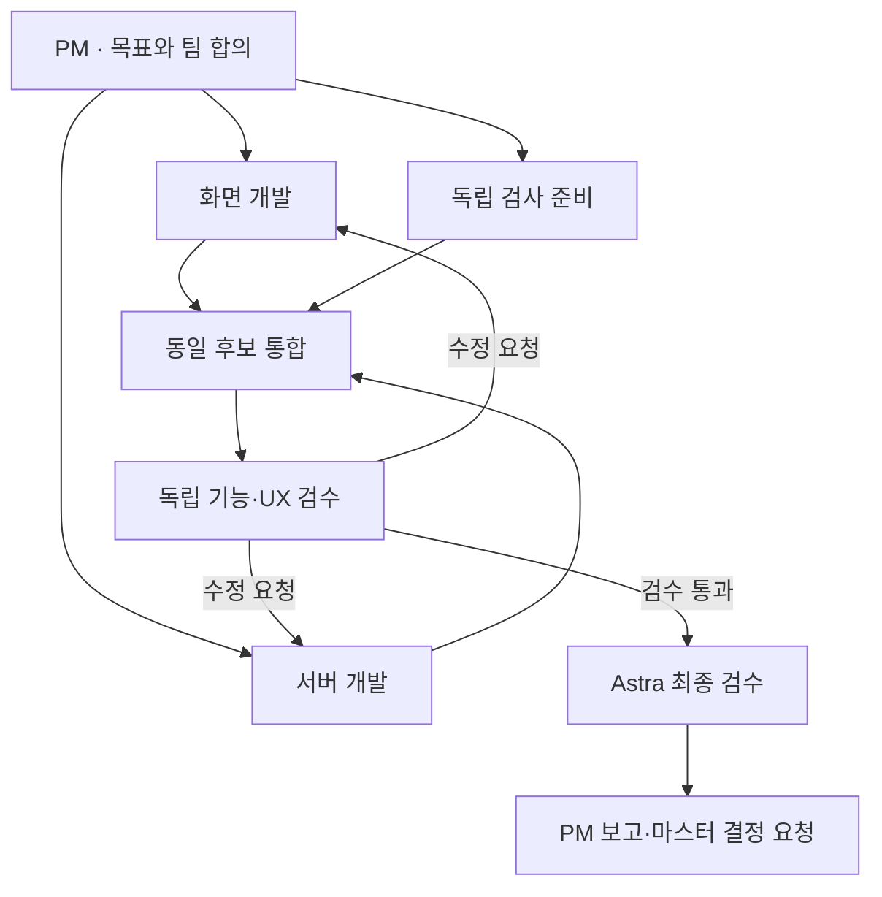

# 화면과 협업 시각화 규격

상태: 후속 설계 제안 · 2026-09-16 · v1.0 · [문서 안내](README.md)

## 1. 시각 방향

기존 B형 Light·Black의 차분한 무채색 작업실을 유지한다. 목표·팀·산출물이 화면의 중심이며 장식보다 정보의 크기·간격·정렬로 우선순위를 만든다. 구현자가 화면마다 새로운 색·폰트·버튼 모양을 고르지 않도록 토큰과 상태 예제를 먼저 정한다.

사용자가 원한 ‘에이전트가 함께 일하는 느낌’은 **역할별 카드, 동시에 움직이는 작업의 표시, 실제 전달물, 수정 반환, 담당 교체**로 표현한다. 에이전트 아바타는 역할을 식별하는 보조 수단이다. 가상의 대화·전달·진척도를 장식으로 만들어 넣지 않는다.

## 2. 화면의 시각적 위계

| 화면 | 첫 영역 | 중심 영역 | 필요할 때 펼치는 영역 |
|---|---|---|---|
| 프로젝트 목록 | 제목·새 프로젝트 | 최근 프로젝트와 검색 결과 | 완료·보관 프로젝트 |
| 매니저 | 프로젝트 목표·현재 질문 또는 다음 행동 | 대화와 팀 | 이전 대화·실행 설정·하네스 |
| 진행 | 목표 대비 현재 결과·내 확인 필요 | 역할별 작업과 전달물 | 원본 이벤트·작업 ID·실행 로그 |
| 승인 | 결정할 내용·대상·영향 | 변경·비용·복구·선택지 | 기술 원문·검증 상세 |
| 기록 | 이번 결과와 남은 일 | 보고·산출물·결정 이력 | CI·커밋·과거 이벤트 |

한 영역에 주요 버튼은 하나를 우선한다. 파괴적·운영 변경 행동은 일반 버튼과 구분하고 정확한 대상을 함께 표시한다. 목표·권한·비용 등 중요한 정보는 ‘상세’로 숨기지 않는다.

데스크톱 매니저는 대화와 팀을 나란히 배치하되 읽는 대화의 폭은 약 60~75자 안팎으로 제한하는 것을 제안한다. 휴대폰에서는 대화 / 팀으로 나누고 현재 프로젝트·다음 행동을 두 탭 모두에서 찾을 수 있게 한다. 팀 카드를 누르면 책임과 완료 조건이 열리고, 진행 화면으로 이어지는 명확한 링크를 제공한다.

## 3. 공통 토큰

다음 색상은 기준 커밋의 [styles.css](https://github.com/HyungwonPark/ai-company/blob/c1af888e8e5d6c7da9f26780ec06751a866147ea/src/ai_company/web/styles.css)에서 확인했다. 실제 조합의 대비는 변경 후 측정한다. 표 자체는 접근성 인증이 아니다.

| 토큰 | Light | Black |
|---|---|---|
| 배경 | `#f5f5f6` | `#17181c` |
| 카드·패널 | `#ffffff` | `#23242a` |
| 본문 | `#222329` | `#eef0f4` |
| 보조 글자 | `#646670` | `#a5a8b4` |
| 경계 | `#dcdce1` | `#41434d` |
| 주요 버튼 배경 | `#25262c` | `#e1e5ef` |
| 주요 버튼 글자 | `#ffffff` | `#1c2028` |
| 성공 | `#246447` | `#94d4b0` |
| 대기·확인 | `#7c5517` | `#e0be7e` |
| 문제 | `#a03432` | `#f0aaa5` |
| 초점 | `#6a7798` | `#acbce6` |

아래 치수는 신규 제안이다. 기존 구현을 일괄 교체하기보다 주요 화면부터 적용한다.

| 항목 | 규격 |
|---|---|
| 본문·대화·입력 | 16px, 줄높이 1.6~1.7; 보조 영역 14px까지 허용 |
| 중요한 상태·행동 설명 | 14px 이상, 일반 보조문보다 높은 대비 |
| 메타데이터 | 12~13px; 핵심 결정·오류 설명을 이 크기로 낮추지 않음 |
| 제목 | 화면 24~30px, 구역 18~20px, 카드 16px |
| 간격 | 4·8·12·16·24·32px의 공통 단계 |
| 모서리 | 기존 8px 유지, 큰 대화상자 12~16px |
| 카드 | 약한 1px 경계, 같은 역할 카드의 구조·내부 여백 통일 |
| 주요 터치 영역 | 최소 44×44 CSS px, 주요 입력·확정 버튼은 높이 48px 권장 |
| 모바일 본문 여백 | 16~20px; 320px에서도 본문·버튼이 잘리지 않음 |

한국어가 실제로 어떤 글꼴로 표시되는지 확인한다. 현재 폰트 목록에 이름이 있다는 이유만으로 해당 한국어 글꼴이 배포된 것으로 판단하지 않는다. 기존 글꼴과 시스템 대체 글꼴을 활용하고, 추가 배포 시 용량·사용 조건·로딩 실패를 확인한다. 본문에는 넓은 영문 자간이나 긴 대문자 제목을 사용하지 않는다. 경로·해시는 별도 고정폭 글꼴과 줄바꿈·복사 기능으로 제공한다.

## 4. 역할과 전달물

### 역할 카드

같은 카드 안의 순서는 다음과 같다.

1. 역할명과 상태: ‘화면 개발 · 진행 중’
2. 맡은 일: ‘목표 입력과 매니저 대화를 연결합니다’
3. 현재 작업과 다음 산출물
4. 기다리는 이유 또는 마지막 완료 결과
5. 담당 모델·요청 설정과 관측 여부
6. 최근 전달물과 상세 열기

역할 ID는 모델 교체와 무관하게 안정적으로 유지한다. 같은 역할에 여러 작업이 있으면 대표 상태와 개수를 보여 주고 상세에서 나눈다. 역할 수, 작업 수, 실제 동시 실행 수를 같은 지표로 합치지 않는다. 실제 실행값이 없는 계획에는 ‘예정’을 표시한다. 모델만 확인되고 추론 설정이 미확인인 경우 확인 배지를 합치지 않는다.

### 관계 그림

아래는 **구조를 설명하는 예시**이며 운영에서 이미 발생한 작업이 아니다. 화면은 승인된 실제 팀과 실행 의존 관계로 구성한다. 독립 검수의 권한·완료 조건은 기존 정책을 따른다.

서버의 용량이 최대 두 실행이면 화면의 세 역할을 동시에 실행 중인 것으로 꾸미지 않는다. ‘독립 검사 준비’는 계약에 따른 테스트 준비 등 선행 가능한 작업을 뜻하며, 통합 후보 실행 검사는 후보가 생긴 다음 수행한다.

### 전달선과 목록

- 기본은 역할 중심 카드와 최근 전달 목록이다. 큰 프로젝트에서는 선택한 작업·역할의 직접 관계만 강조하고 나머지는 약하게 표시한다.
- 계획상의 의존은 점선과 ‘예정’, 기록된 전달은 실선과 ‘전달됨’, 수정 요청은 역방향과 ‘수정 요청’으로 구분한다. 색만으로 의미를 전달하지 않는다.
- 선·카드·전달 목록은 동일한 이벤트/산출물을 가리킨다. 클릭하거나 키보드로 선택하면 출발·도착·산출물 제목·시각·사유를 같은 상세 패널에 보여 준다.
- 모바일은 연결선을 기본으로 축소하고 세로 카드·전달 목록을 제공한다. 전체 관계 보기는 선택 사항이며 필수 승인 조작이 도표의 확대·드래그를 요구하지 않는다.
- 이관은 ‘역할 유지 / 담당 변경 / 이유 / 다음 재개’를 표시한다. 과거 담당의 늦은 결과가 현재 결과처럼 보이지 않게 버전·시도를 구분한다.

### 움직임

새 실제 전달 이벤트가 들어왔을 때만 관련 카드·선에 150~250ms의 짧은 강조를 사용한다. 기본 전환도 같은 범위로 제한한다. 움직임 시간은 디자인 제안이며 성능 측정 결과가 아니다. 페이지 복귀 후 과거 이벤트를 모두 재생하거나 계속 입자가 흐르는 선으로 실행을 가장하지 않는다.

사용자 설정 `prefers-reduced-motion`에서는 이동·펄스를 없애고 정적인 경계·문구 변화로 알린다. 상태 변화는 적절한 접근성 상태 메시지로 알리되 전체 대화를 반복 낭독하지 않는다. 오류 배너가 초점을 빼앗거나 작성 중인 입력창을 자동 스크롤하지 않게 한다.

## 5. 공통 컴포넌트 계약

새 프레임워크 도입은 전제하지 않는다. 현재 웹 모듈을 이용하고 작은 공통 컴포넌트부터 정리한다.

| 컴포넌트 | 필수 정보 | 피해야 할 동작 |
|---|---|---|
| 프로젝트 카드 | 이름·목표·상태·최근 활동·확인 건수 | 이름만으로 프로젝트 식별 |
| 다음 행동 카드 | 누가·무엇을·왜·누르면 생기는 변화 | 일반적인 ‘계속’ 버튼만 제공 |
| PM 요청 상태 | 접수·실행·응답·마지막 갱신 | 대기 애니메이션을 실제 응답으로 표시 |
| 역할 카드 | 책임·작업·산출물·담당·상태 | 준비된 역할을 실행 중으로 표시 |
| 전달 상세 | 실제 출발·도착·문서·시각·이유 | 가상 메시지·임의 전달선 |
| 승인 카드 | 종류·대상·변경·영향·예산·복구·버전 | 모든 종류를 동일한 승인으로 처리 |
| 보고 카드 | 결과·남은 일·문제·결정·출처 | 테스트 수만으로 전체 완료 선언 |
| 빈 상태 | 왜 비어 있는지·가능한 다음 행동 | 존재하지 않는 프로젝트를 열라고 안내 |
| 연결 상태 | 현재 연결·기록 시점·재연결 | 캐시 기록을 최신으로 표시 |

## 6. 접근성과 시각 검수

공식 기준은 A급 자료인 W3C를 따른다. 아래 일부 항목 충족만으로 WCAG 전체 적합성을 주장하지 않는다.

- 일반 글자 대비 4.5:1 이상, 큰 글자 3:1 이상을 측정한다. 큰 글자는 표준의 크기·굵기 조건으로 판단한다. [공식 대비 설명](https://www.w3.org/WAI/WCAG22/Understanding/contrast-minimum.html)
- 320 CSS px 너비에서 일반 본문·폼에 가로 스크롤을 요구하지 않는다. 관계 그림이 필요하면 영역 내부 이동과 동등한 목록을 제공한다. [공식 Reflow 설명](https://www.w3.org/WAI/WCAG22/Understanding/reflow.html)
- WCAG 2.2 AA의 최소 터치 대상은 예외 조건을 포함해 24×24 CSS px다. **우리 제품의 44px는 더 넉넉한 자체 설계 기준**이다. 모든 동작에 보이는 초점·키보드 접근·읽을 수 있는 이름을 제공한다. [공식 Target Size 설명](https://www.w3.org/WAI/WCAG22/Understanding/target-size-minimum.html)
- 움직임 감소 설정과 동적인 상태 안내를 지원한다. 움직임 감소는 추가 제품 기준이며 AA 요건 전체와 혼동하지 않는다. [공식 CSS 기법](https://www.w3.org/WAI/WCAG22/Techniques/css/C39) · [공식 상태 메시지 설명](https://www.w3.org/WAI/WCAG22/Understanding/status-messages.html)

검수 화면은 Light·Black 각각 320·360·390px와 데스크톱 1440px를 포함한다. 긴 한국어·긴 모델명·200% 글자 확대·키보드가 열린 모바일·느린 연결·빈 상태·PM 질문·사용량 대기·번역 실패·승인 대기·잘못된 프로젝트 링크를 확인한다. 긴 승인 대상이나 오류 설명을 생략해 화면을 맞추지 않는다.

캡처에는 커밋, 화면, 테마, 너비, 상태 시나리오, 모의/실제 구분을 남긴다. 같은 화면의 수정 전후를 비교하고 실사용 계정·키·비공개 입력은 포함하지 않는다. 시각 검수자는 주요 행동을 먼저 찾을 수 있는지와 같은 상태가 같은 표현을 쓰는지 함께 평가한다.
