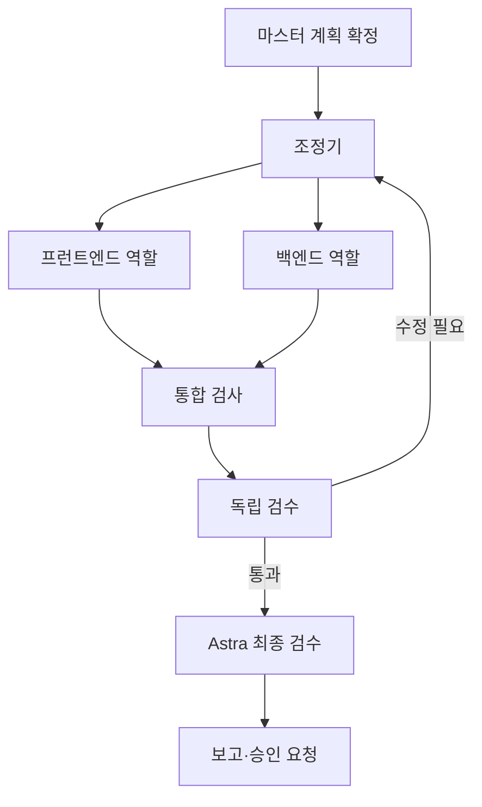

# 작업실 통합 명세: 역할 그래프 · 모델 연결 · ECC · Archify

상태: PR #15 다음 구현을 위한 명세 초안 · 2026-09-16 UTC · v1.0

## 1. 목표와 적용 범위

마스터가 PM과 목표·팀·계획을 정하고, 역할별 병렬 작업과 실제 전달물을 그래프로 확인하며, 한국어 보고와 필요한 승인을 따로 읽을 수 있는 작업실을 만든다.

PR #15의 세 작동 시안을 재사용해 **A 작업실을 기본 대화, B 작업대를 진행, C 결정함을 승인**에 조합한 통합 후보를 준비한다. 이는 다음 구현의 추천 기준이며 마스터가 디자인을 최종 선택했다고 기록하지 않는다. 세 시안을 처음부터 다시 만들거나 추상적인 취향 질문을 반복하며 작업을 멈추지 않는다. 기존 시안은 비교·회귀 자료로 보존한다.

첫 가시적 산출물은 **한국어로 노드와 전달선을 눌러볼 수 있는 역할 그래프**다. 새 스킬 설치·모델 로그인·서명키 백업이 모두 끝나야 그림을 만들 수 있는 구조로 작업을 묶지 않는다.

이번 문서 작성은 아래 구현의 명세화까지다. 외부 도구 설치, 하네스 변경, 실제 로그인·모델 호출, 운영 배포·병합을 수행했다는 뜻이 아니다.

## 2. 기준 상태와 문서 우선순위

| 자료 | 고정 기준 | 확인된 범위 |
|---|---|---|
| PR #13 | `f93339134b011cf1359d90697980563add05c981` | `23ac8a7` 웹·PM/조정기·pilot 카탈로그 적용 기록. 새 실제 마스터 실행 전체 검증은 별도 |
| PR #15 | `730464bb54d314d3898fc86991e6889cab8381da` | A/B/C 작동 미리보기, 예시 데이터, 격리 브라우저·독립 검수와 연결된 CI 기록 |
| PR #14 | `7d36caa83d963c8f49bccf9c5084674b29815e42` | 역할 그래프·모델 연결 후속 명세. PR #15에는 이 두 파일이 아직 없음 |
| ECC | `8321021c54d670126ce3b2969d5deb880b4b0c2a` | 선정한 역할·조사·검증·인수인계 파일의 소스 검토 |
| Archify | `72c750bb070d95171dbb2244e5b62b1b7da69c12` | 2.17.0-dev.1 개발 소스. 앞선 평가 이후 의존성 override 수정 포함 |

이 변경에는 PR #14의 [그래프 명세](graph-workspace-2026-09-16.md)와 [모델 연결 명세](model-connections-2026-09-16.md)를 같은 내용으로 가져온다. 이 문서가 후속 구현 순서·도구 선택의 통합 기준이고 두 문서는 세부 계약이다. 초기 frontend-redesign 문서의 세 시안 제작 지시는 PR #15에서 수행한 과거 단계로 읽는다.

현재 코드·시안·운영 적용 상태가 다르면 최신 고정 기록과 실제 실행 증거를 확인한다. 문서 버전만으로 이미 확정된 실행·승인을 변경하지 않는다.

## 3. 화면과 사용 흐름

프로젝트의 기본 탐색은 **매니저 / 진행 / 승인 / 기록**, 프로젝트 바깥 공통 메뉴에는 **프로젝트 / 모델**을 둔다. 보고는 기록에서 읽고 매니저·진행에서도 같은 실행의 보고로 바로 이동한다.

| 화면 | 우선 보여 줄 것 | 상세에서 제공할 것 |
|---|---|---|
| 프로젝트 | 이름, 목표 한 줄, 다음 행동, 최근 의미 있는 변화 | 저장소·명세·실행 이력 |
| 매니저 | 현재 PM 질문, 제안 이유, 입력창, 계획 검토 | 역할·하네스·의존성·허용 파일·완료 기준 |
| 진행 | 그래프/목록, 역할별 현재 일·모델·대기·전달 | 해당 산출물·모델 근거·인수인계·검사 |
| 승인 | 내가 결정할 대상, 변경·영향·근거·선택 | 원문, 읽기용 번역, 비용·복구·버전 |
| 기록 | 목표 대비 달성·남은 일·차단·결정 필요 | 실행별 보고·검사·변경 이력·그림 내려받기 |
| 모델 | 제공자·계정 연결, 모델·추론 설정·사용 가능 여부 | 검증 근거, 공유 한도·재개 시각·사용 중인 역할 |

이름·자연어 목표 → PM 대화·제안 → 역할/명세 검토·저장 → 고정된 새 계획 → 마스터 직접 확정 → 실행 순서를 유지한다. 명세 저장과 실행 승인을 같은 사건으로 합치지 않는다. 앞 단계가 바뀌어 계획이 오래되면 이유와 다시 검토할 부분을 보여 준다.

**정체 표시 개선:** 마스터 결정 대기, 로그인 필요, 사용량 회복 대기, 선행 작업 대기, 검증 실패를 구별한다. 누가 무엇을 하면 다음 단계로 가는지 표시한다. 대기 상태를 무조건 장애나 전체 목표 실패로 집계하지 않고, 자동으로 할 일이 없는 동안 같은 모델 호출과 승인 질문을 반복하지 않는다.

## 4. 역할과 병렬 실행

역할은 업무의 소유자이고 모델 연결은 실행 수단이다. PM이 프로젝트별 역할·업무·의존·전달물·완료 기준을 제안하며, 마스터와 확정한 명세가 실행 범위가 된다.

| 역할 | 적용 기준 |
|---|---|
| PM | Astra Ultra. 목표·계획·분담·보고를 담당하며 마스터의 실행 확정을 대행하지 않음 |
| 개발 | 승인된 Astra High 또는 Claude 후보. 요청 effort와 실제 관측 증거를 별도 기록 |
| 검사 | 승인된 결정적 검사 명령을 우선. 테스트·정적 검사 자체에 불필요한 모델 호출을 붙이지 않음 |
| 독립 검수 | 개발 결과와 근거를 별도 검수 세션에서 검토. 같은 작성자의 자기평가만으로 대체하지 않음 |
| 최종 검수 | 기존 Astra Ultra 고정 정책. 필수 모델 대기 중 다른 역할의 결과로 통과시키지 않음 |
| 번역 | 기존 검증된 저비용 번역 후보. 원문·숫자·식별자·결정 권한 보존 |

아래는 병렬 구조를 설명하는 개념도이며 현재 운영 실행이나 고정된 모든 프로젝트의 팀 구성은 아니다.

의존하지 않는 업무만 병렬 배정한다. 기존 서버 용량·공통 Git 디렉터리·파일 소유권·동시 실행 최대 2개 조건을 유지한다. 개발 분기와 합류 대상 커밋을 고정하고 이전 후보 검사를 새 합류 커밋의 검사로 재사용하지 않는다.

사용량 제한은 기존 공유 계정 그룹과 적격 후보 정책으로 이관하거나 영속 대기한다. 역할·작업·계획 식별자는 유지하고 담당 세션과 이관 근거를 기록한다. 컨텍스트 부족은 별도 인수인계로 처리하며 다른 제공자로 옮긴 실행을 같은 CLI 세션 재개라고 표시하지 않는다.

PR #15 예시 데이터의 Claude `xhigh` 값이나 관측값 없음은 실제 Ultracode 검증 근거가 아니다. 기존 운영 기록과 실제 호출 근거를 사용한다.

## 5. ECC 선택 도입

ECC는 각 역할의 작업 방식을 보완하는 참고·하네스 재료로 사용한다. 실행·예산·승인·재개 상태의 원본은 기존 ai-company 서버다.

| 선정 자료 | 프로젝트에서 만들 산출물 | 그대로 가져오지 않을 것 |
|---|---|---|
| planner | 요구·역할·의존·담당 파일·완료 조건이 있는 PM 계획 형식 | 원본의 모델 기본값 |
| search-first | 기존 모듈·승인 의존성 우선 조사와 선택 이유 | 작은 수정마다 무제한 외부 조사 |
| verification-loop | 명령·종료 코드·커밋·실행 ID·증거를 연결한 검사 보고 | 범용 npm/pyright 예시나 임의 커버리지 수치의 필수화 |
| code-reviewer | 재현 조건·위치·영향·근거가 있는 독립 검수 | 원본 모델 지정, 근거 없는 결함·취향 수정 반복 |
| checkpoint / strategic-compact | 단계 경계의 현재 상태·결과·남은 일·다음 담당자 인수인계 | 무조건 git stash/commit, 별도 재시도 엔진 |

초기 구현은 프로젝트 전용으로 변환한 소수의 문서 묶음으로 한다. 각 묶음에는 `harness_id/version/content_hash/source_commit/role`, 선택한 파일과 변경 이유를 기록하고 실행 명세에 버전을 고정한다. 실제 실행기가 전달한 버전·해시와 전달 시각을 기록한다. 파일이 있다는 사실이나 읽으라는 프롬프트만으로 적용 성공을 판정하지 않는다.

인수인계에는 프로젝트·계획 digest·역할·작업·시도 ID, 기반/결과 커밋, 산출물, 검사 상태, 실패 원인, 남은 일, 다음 안전한 행동을 담는다. 비밀번호·토큰·인증 파일·무제한 원문 대화를 포함하지 않는다. 요약은 실제 저장 기록을 찾는 보조 자료이며 승인·검사 원문을 대체하지 않는다.

전체 ECC 설치, 전역 설정 덮어쓰기, MCP 일괄 추가, hook 일괄 등록, 자동 학습·공유 메모리의 즉시 적용, 독립적인 무한 루프는 첫 범위에서 제외한다. 기존 claude-mem 등과 중복 관측·수집을 추가하지 않는다. 향후 학습은 프로젝트별 변경 제안으로 남기고 검토 후 새 하네스 버전으로 반영한다.

ECC 원본의 `model: opus/sonnet`, 승인·샌드박스·병렬 수 설정은 우리 역할 정책으로 대체한다. 추가 자동 명령이나 모델 호출은 호출 주체·한도·근거가 있어야 하며 기존 예산과 실행 소유권 안에서 수행한다.

## 6. Archify 적용과 실제 진행 그래프

두 표현이 같은 계획·작업 식별자를 사용하되 표시 시점과 의미를 명시한다.

| 종류 | 데이터와 갱신 | 첫 구현 |
|---|---|---|
| 실제 진행 그래프 | 확정 계획 + 현재 실행/전달 이벤트. 기존 overview의 5초 갱신 재사용 | 기존 SVG 확장 또는 검토한 그래프 렌더러로 확대·이동·맞춤·선택 구현 |
| 계획·보고서 그림 | 특정 계획 또는 실행 시점의 고정 JSON을 Archify로 생성 | 역할 분담, 전달 관계, 검사·승인·대기 요약. HTML/SVG와 생성 근거 보관 |

Archify의 노드·관계·역할별 구획·검색·경로 탐색 표현을 참고한다. 현재 viewer는 독립 HTML 중심이므로 제품의 지속적인 데이터 갱신 컴포넌트처럼 바로 사용한다고 가정하지 않는다. 실시간 그래프를 Archify 내부 구조에 맞추느라 선행 조건으로 막지 않는다.

첫 Archify 적용은 서버의 허용된 변환기가 저장 기록을 JSON으로 만들고, 고정된 렌더러가 그림을 생성하는 방식이다. 매 갱신마다 AI가 그림을 다시 작성하지 않는다. AI는 계획·설명 작성에 활용하고 상태·연결·판정은 기록에서 결정적으로 변환한다.

그림에는 프로젝트, 계획/실행 ID, 계획 digest, 자료 기준 시각, 예시/계획/실행 구분을 표시한다. 원본 JSON·생성기 버전·Archify 커밋·입력/출력 해시·검증 결과를 연결한다. 이전 그림을 유지할 경우 이전 시점과 새 생성 실패를 알리며 현재 상태로 표시하지 않는다.

실제 진행의 필수 동작:

- PC·APK 모두 그래프/목록을 제공한다. 모바일에서 선이나 그래프 자체를 숨기지 않는다.
- 역할/업무 노드와 의존/전달선을 구별하고 요청/관측 모델·상태·현재 일을 상세에서 확인한다.
- 클릭·키보드 선택으로 산출물과 대기·이관·검수 근거를 연다. 같은 ID의 위치·선택·확대 상태를 갱신 때 보존한다.
- 병렬 분기·합류·수정 반환과 계획/실제 전달을 구별한다. 모든 예정 역할이 실제 동시에 실행 중인 것처럼 표시하지 않는다.
- 최근 전달 제한과 과거 이력을 명시한다. 보이지 않는 과거 전달을 없는 사실로 바꾸지 않는다.
- 움직임은 실제 새 이벤트를 한 번 알리는 범위로 제한한다. Archify의 설명 재생은 별도로 표시하고 실제 작업 증거로 세지 않는다.

### Archify 패키지와 UI 조건

고정 소스와 잠금 의존성을 격리된 빌드에서 검증하고 프로젝트 자산으로 묶는다. 전체 전역 스킬 설치·최신 main 자동 갱신을 요구하지 않는다. Node >=18 선언과 서버의 이전 Node 22 확인만으로 새 패키지·브라우저 동작 검증을 생략하지 않는다. `ARCHIFY_UPDATE_CHECK_DISABLED=1` 등 지원 옵션으로 선택적 업데이트 조회를 끄고 실행 데이터·프롬프트를 외부로 보내지 않는 생성 경로를 검증한다.

생성된 HTML에는 스크립트가 있으므로 운영 페이지에 문자열로 그대로 삽입하지 않는다. 첫 제공은 마스터 권한으로 접근하는 별도 그림 보기/다운로드를 기준으로 하고, 실행 가능한 그림은 운영 세션·API 권한과 격리한다. iframe을 쓰면 opaque origin 등 격리 조건·CSP·내보내기를 함께 검증하며 운영 전체의 CSP를 완화하지 않는다. `?embed=1`은 도구를 숨기는 갤러리용이므로 탐색 기능이 그대로 유지된다고 가정하지 않는다.

기본 UI 언어는 en/zh-CN이다. 독립 보기의 조작부까지 한국어로 보완하거나 한글 조작부가 있는 제품 보기와 정적 SVG를 제공한다. 미지원 `locale: ko` 값을 넣고 완료 처리하지 않는다. 변경한 번역·접근성 문구와 글꼴·폭 계산을 검증한다. 개발자용 작은 고정폭 글꼴·영문 도구명을 한국어 모바일에 그대로 복제하지 않는다.

MIT 본문과 가져온 코드의 고지를 보존하고 글꼴·브랜드 자산의 별도 고지도 확인한다. 검증 receipt는 구조·그림 생성 근거이며 실제 제품 실행·사람의 미감·마스터 승인 증거가 아니다.

## 7. 모델 연결과 계정 현황

세부 조건은 [모델 연결 명세](model-connections-2026-09-16.md)를 따른다. 공통 모델 화면은 기존 Codex·Claude 계정을 읽어 먼저 표시하고 **연결 추가 → 공식 로그인 → 연결 확인 → 제한된 실행 확인 → 역할 후보** 흐름을 제공한다.

로그인, 모델/effort 검증, 실행 가용성은 별도 상태다. 남은 토큰·회복 시각·실효 effort를 제공자가 확인해 주지 않으면 확인 불가로 표시한다. Astra High·Ultra를 다른 계정이나 독립 한도로 세지 않는다.

첫 지원은 제공자당 기존 한 연결이다. 현재 credential_ref는 인증 저장소 선택기가 아니고 credential_groups는 provider당 한 계정이므로 다중 계정은 별도 구조 확장 뒤 제공한다. 기존 인증을 덮거나 전역 로그아웃하지 않는다. 실제 worker·재개·번역·systemd 자식까지 같은 연결 선택이 전달되어야 한다.

공식 로그인 방식은 CLI 설치본과 같은 서비스 환경에서 검증한다. 자격 증명은 공식 지원 저장 방식에 두고 브라우저·Git·일반 관리 DB·프롬프트에 넣지 않는다. 실제 로그인을 해야 하는 단계는 마스터가 수행하되 그 전의 화면·모의 검증·오류 복구는 먼저 완성한다.

실행 확인 호출도 공유 한도·예산·동시 실행 예약·멱등성을 적용한다. 후보는 서버 카탈로그 안에서만 고르고 새 연결 성공으로 기존 계획·역할·권한을 바꾸지 않는다. ECC 지원 도구 목록이 우리 실행기의 새 AI 어댑터를 자동으로 제공하는 것은 아니다.

## 8. 공통 데이터와 권한 계약

기존 관리 API·DB의 사실을 우선 재사용하고 부족한 조회만 확장한다. 별도 대시보드 DB나 ECC/Archify 내부 상태를 실행 원본으로 만들지 않는다.

| 자료 | 반드시 연결할 식별자와 의미 |
|---|---|
| 화면 조회 | 조회 스키마 버전, project_id, plan_id/digest, run_id, 관측 시각, cursor |
| 노드·선 | 안정된 역할/업무/산출물 ID, 관계 종류, 예정/관측 구분, 근거 참조 |
| 상태 이벤트 | event_id, run/role/task/attempt ID, 원인, 이전/현재 상태, 서버 순서 |
| 모델 | connection_id/버전, 후보 ID, 요청 모델/effort, 관측값·시각·출처, 공유 한도 |
| 하네스 | 적용한 ID/버전/해시, 원본 출처 커밋, 역할·실행 결속 |
| 그림 | snapshot_id, 입력 근거/digest, 자료 시각, 생성 버전, 파일 해시, 성공/실패 |
| 승인·보고 | 정확한 대상과 버전, 요청 원문, 읽기용 번역 참조, 실행·검수 근거 |

이는 필요한 논리 필드이며 기존 스키마와 겹치는 테이블·이벤트를 다시 만들라는 지시가 아니다. public 응답에는 비밀 경로·토큰·불필요한 계정 식별자를 포함하지 않는다.

같은 cursor 재전달은 중복 표시하지 않고 오래된 응답은 새 상태를 덮지 않는다. 프로젝트 전환 시 이전 응답·보고·승인이 새 프로젝트에 섞이지 않아야 한다. 재접속과 응답 유실 시 원래 요청의 키·본문을 보존해 저장 결과를 확인한다.

읽기 API·화면 갱신·그림 생성·스킬 로딩이 개발 시작이나 승인을 발생시키면 안 된다. 계획·승인·역할 변경은 기존 세션·CSRF·권한·불변 명세 검사를 통과해야 한다. UI에서 노드 이동은 표시 위치만 바꾼다.

## 9. 한국어·보고·번역

보고 첫 화면은 목표 대비 완료, 진행 중, 대기 이유, 마스터 결정, 다음 행동 순서로 쓴다. PM 작성 설명·시스템 집계·번역 출처를 구별한다. 계획 확정·후보 승인·운영 적용은 다른 사건이다.

읽기용 번역은 source_hash와 번역 후보·검사 상태를 연결한다. 원문·숫자·권한·부정·코드 식별자 보존을 확인하고 실패 번역은 원문을 볼 수 있게 유지한다. 기존 실패 기록을 삭제하거나 새로운 승인 없이 재시도 예산을 늘리지 않는다.

UI 라벨과 상태명은 관리되는 한국어 문자열로 제공한다. 새로고침마다 번역 모델을 호출하지 않으며, Archify UI 번역도 배포된 문자열로 처리한다. 알림은 한 승인 요청·상태 변경에 대응하고 같은 대기 상태에서 중복 생성하지 않는다.

## 10. 구현 순서와 병렬 분담

### 기존 코드 연결점

경로는 현재 구현을 찾는 출발점이며 아래 모든 파일을 반드시 변경하라는 목록은 아니다. 역할별 수정 소유권과 필요한 검사를 먼저 정한다.

| 기존 경로 | 연결할 기능 |
|---|---|
| `src/ai_company/web/workspace-preview/` | A/B/C 배치·동선 재사용. 예시 `model.js/data.js`는 운영 어댑터로 사용하지 않음 |
| `web/app.js`, `web/manager-ui.js` | 기존 인증·초안·5초 조회와 A 대화 연결 |
| `web/execution-ui.js`, `web/plan-ui.js` | 명세 저장·새 계획·직접 확정, base_harness_version과 digest·멱등 키 보존 |
| `web/collaboration-ui.js`, `web/styles.css` | 그래프 렌더링·선택·목록·모바일 선 숨김 대체 |
| `collaboration.py`, `management.py` | 기존 cursor/source/nodes/transfers 조회와 그림용 표현 변환 |
| `management_server.py` | overview·events·execution-specs·confirm·decisions 계약 재사용. 제공자 로그인은 기존 마스터 `/api/login`과 분리 |
| `web/documents-ui.js`, `web/report-ui.js` | C 승인 문서·읽기용 번역·같은 실행의 보고 |
| `flow_contracts.py`, `dispatcher.py`, `execution_specs.py`, `adapters/session_cli.py` | 하네스·연결 버전 전달, 역할·한도·실행 계약 보존 |

위 표의 `web/`와 파이썬 파일은 `src/ai_company/` 아래다. 새 렌더러·로그인 모듈은 기존 책임과 분리하되 같은 실행기를 재사용한다.

### 단계별 산출물

| 단계 | 산출물과 선행 조건 | 담당·완료 기준 |
|---|---|---|
| P0: 연결 계약 | PR15 보존, PR14 세부 명세 반영, 실제 API/예시 경계와 읽기 데이터 매핑 | PM/구현자. 아래 사용자 과제가 가능한 구체 작업 목록 |
| P1: 보이는 그래프 | A+B+C 통합 후보, 진행 그래프/목록, 한국어 상세, 실제 읽기 API와 예시 모드 분리 | 프런트+조회 API. PC/모바일에서 클릭 가능한 후보를 먼저 제시 |
| P2-A: 그림 | 같은 계획·실행의 JSON→Archify 보고 그림, 생성 실패·내보내기·한국어 보기 | 시각화 담당. 고정 snapshot·해시·시점 대조 |
| P2-B: 하네스 | 선정 ECC 문서를 역할별로 변환하고 실제 전달/검증/인수인계 연결 | 하네스 담당. 버전·해시·실행 결속 증거 |
| P2-C: 모델 | 기존 연결 현황, 공식 로그인 흐름·제한된 실행 확인·역할 후보 | 계정 담당. 모의 오류·동일 worker 인증 선택 검증 |
| P3: 통합 검증 | 변경된 코드의 회귀·원격 CI·독립 검수, 같은 실행의 그래프/문서/검사 대조 | 개발자와 별도 검수. 명세·승인 경계 보존 |
| P4: 적용·직접 사용 | 고정 후보·영향·복구안 준비 후 해당 범위의 승인 확인, 마스터 APK 입력/확정 | 운영 적용 증거와 실제 사용자 사건을 각각 기록 |

P2 작업은 P0의 식별자/계약을 공유해 독립 파일·작업 공간에서 나눌 수 있지만 기존 동시 실행 상한 안에서 배정한다. P2-C의 실제 로그인 대기나 외부 백업 대기를 P1/P2-A/P2-B의 개발 중단 이유로 사용하지 않는다. 한 작업의 완료를 전체 목표 완료로 보고하지 않는다.

서버에서 문서만 계속 늘리지 않는다. 각 단계는 실제 후보 화면·코드·근거를 내고, 첫 구현 PR에는 그래프에서 노드와 전달선을 누르는 동작을 확인할 수 있어야 한다. 새 워크플로 엔진·인증 제공자·자동 학습 플랫폼을 추가 목표로 확장하지 않는다.

## 11. 수용 기준과 검증 범위

| 검증 | 통과 조건 |
|---|---|
| 사용자 동선 | 프로젝트 찾기→PM 답변→팀·계획 검토→직접 확정. 확정 전 개발 0건, 같은 확정 재시도는 1건 |
| 병렬 그래프 | 독립 역할 분기·합류·수정·quota 이관·필수 최종 검수 대기를 같은 실행 기록과 대조 |
| 모바일/접근 | Light·Black × 320/390/1440px, 키보드·확대·44px 주요 터치·줄인 동작·한국어 실제 글리프 |
| 갱신/복구 | 5초 갱신·프로젝트 전환·오프라인 복귀 중 입력/초점/선택 보존. 중복·늦은 이벤트 차단 |
| Archify | 같은 입력/버전의 재현 가능한 출력·receipt, 시점 표시, 한국어 조작, 실패 시 오래된 그림 식별 |
| 하네스 | 선정 버전 실제 전달, 검사 실패/미수행 구별, 인수인계 후 정책·계획·예산 유지 |
| 모델 연결 | 인증/적격/가용 구분, 취소·만료·기존 계정 보존, 같은 worker 경로 확인, 확인 호출 한도 |
| 승인·번역 | 대상 digest·프로젝트·실행 일치, 원문/읽기용 번역 구별, PR #10 pending 보존 |
| 운영 보존 | 커플 서비스·기존 데이터·큐·timer·격리 정책 유지, 변경 범위와 복구 경로 대조 |

검사는 실제 바뀐 위험에 맞춘다. 기존 Python/UI/Android 검사 계약을 사용하고 새 테스트 개수나 ECC의 임의 수치를 목표로 삼지 않는다. Archify 구조 검증·브라우저 검사·독립 시각 검수를 구별한다.

실제 계정 한도를 고의 소진하지 않고 모의 quota와 기존 검증 기록을 사용한다. 실제 모델 호출은 정한 작은 예산 안에서 확인한다. 중단된 프로세스의 종료가 불명확하면 대조 전 중복 실행하지 않는다.

CI·모의 데이터 통과를 Android 실기기·운영 모델 호출 성공으로 표시하지 않는다. 실제 APK 목표 입력·계획 확정은 마스터가 수행한다. 프런트엔드 자동 검증이 마스터 위임이나 PR #10 승인이 되지 않는다.

## 12. 적용·복구와 남은 범위

기존 운영 적용에 대한 유효한 승인 범위를 먼저 확인하고, 이미 승인된 동일 범위를 반복 질문하지 않는다. 새 후보·서비스·권한 변화가 그 범위를 넘으면 이미지/커밋·변경 대상·영향·검증·복구안을 먼저 완성해 추가 승인 경계를 구체적으로 제시한다.

웹 정적 자산, Archify 생성 작업, ECC 하네스 선택은 가능하면 독립적으로 비활성화할 수 있게 한다. 되돌릴 때 새 형식의 명세·연결·실행이 생겼다면 구 worker와의 호환성을 먼저 확인하고 새 배정을 멈춘다. 진행/예약 작업과 읽기 가능한 관리 화면은 유지한다. DB 전체를 과거 사본으로 복원해 승인·실행 기록을 지우지 않는다.

서명키 외부 보관·복원은 기존 사용자 확인 항목으로 남긴다. 키를 Git·일반 로그에 올리지 않는다. 기존 pilot 제한은 이 문서로 넓어지지 않는다. 새 UI/하네스 작업을 자동 배정하려면 해당 파일·검사·역할 범위가 승인된 실행 명세로 준비되어야 한다.

완료 보고는 **구현/모의 검증/실제 호출/실기기/운영 적용/마스터 확인 대기**를 나누어 적는다. 필요한 사용자 행동이 남으면 대상 화면·이름·버튼과 이유를 특정하고, 존재하지 않는 프로젝트를 찾아 확정하라고 안내하지 않는다.

## 13. 서버 Codex에 전달할 작업

> PR #15의 완료된 A/B/C 시안과 PR #13 운영·실행 계약을 보존하고 이 통합 명세를 기준으로 다음 개발을 진행하세요. 초기 세 시안을 다시 만들지 말고 A 대화+B 진행 그래프+C 승인 문서를 결합한 추천 후보를 준비하세요. PR #14의 그래프·모델 연결 세부 명세도 함께 읽으세요.
>
> 첫 산출물은 PC와 APK 크기에서 노드·전달선을 누를 수 있는 한국어 그래프와 같은 실행의 상세입니다. 예시 모델을 실제 API로 가장하지 말고, 실제 읽기 자료와 연결하면서 기존 확정·승인 경계를 유지하세요.
>
> ECC는 선정한 계획·조사·검증·검수·인수인계 지침만 프로젝트 하네스로 변환하고, Archify는 고정 계획/보고 그림부터 연결하세요. 전역 설정·모델·권한·MCP·자동 학습·재시도 엔진을 일괄 설치하지 마세요. 모델 로그인은 별도 작업으로 진행해 그래프 개발을 막지 마세요.
>
> 실제 화면·조작·실행 데이터 대조와 독립 검수 후 초안 PR, 고정 후보, 적용·복구안을 준비하세요. 운영 적용은 기존 승인 범위와 후보 변경을 대조하며, 마스터 대신 실제 목표·계획을 확정하거나 PR #10 pending을 바꾸지 마세요.

## 14. 출처와 검토 한계

기능·코드는 프로젝트 공식 저장소의 1차 자료(A급)로 확인했다. 저자의 생산성·미감 효과 주장은 우리 제품에서 검증된 성과가 아니다. 설치본·실기기·운영 접목은 후속 검증 대상이다.

- [PR15 검수·시안 기록](https://github.com/HyungwonPark/ai-company/blob/730464bb54d314d3898fc86991e6889cab8381da/docs/product-experience/workspace-preview-2026-09-16.md), [PR13 운영 적용](https://github.com/HyungwonPark/ai-company/blob/f93339134b011cf1359d90697980563add05c981/docs/project-execution-activation-2026-09-16.md).
- ECC: [계획](https://github.com/affaan-m/ECC/blob/8321021c54d670126ce3b2969d5deb880b4b0c2a/agents/planner.md), [기존 구현 조사](https://github.com/affaan-m/ECC/blob/8321021c54d670126ce3b2969d5deb880b4b0c2a/skills/search-first/SKILL.md), [검증](https://github.com/affaan-m/ECC/blob/8321021c54d670126ce3b2969d5deb880b4b0c2a/skills/verification-loop/SKILL.md), [검수](https://github.com/affaan-m/ECC/blob/8321021c54d670126ce3b2969d5deb880b4b0c2a/agents/code-reviewer.md).
- ECC: [체크포인트](https://github.com/affaan-m/ECC/blob/8321021c54d670126ce3b2969d5deb880b4b0c2a/commands/checkpoint.md), [컨텍스트 정리](https://github.com/affaan-m/ECC/blob/8321021c54d670126ce3b2969d5deb880b4b0c2a/skills/strategic-compact/SKILL.md), [설정](https://github.com/affaan-m/ECC/blob/8321021c54d670126ce3b2969d5deb880b4b0c2a/.codex/config.toml), [hooks](https://github.com/affaan-m/ECC/blob/8321021c54d670126ce3b2969d5deb880b4b0c2a/hooks/hooks.json), [MIT](https://github.com/affaan-m/ECC/blob/8321021c54d670126ce3b2969d5deb880b4b0c2a/LICENSE).
- Archify: [스킬·생성 계약](https://github.com/tt-a1i/archify/blob/72c750bb070d95171dbb2244e5b62b1b7da69c12/archify/SKILL.md), [viewer](https://github.com/tt-a1i/archify/blob/72c750bb070d95171dbb2244e5b62b1b7da69c12/viewer/README.md), [제품 범위](https://github.com/tt-a1i/archify/blob/72c750bb070d95171dbb2244e5b62b1b7da69c12/PRODUCT.md), [스키마](https://github.com/tt-a1i/archify/blob/72c750bb070d95171dbb2244e5b62b1b7da69c12/archify/schemas/README.md).
- Archify: [패키지](https://github.com/tt-a1i/archify/blob/72c750bb070d95171dbb2244e5b62b1b7da69c12/archify/package.json), [MIT](https://github.com/tt-a1i/archify/blob/72c750bb070d95171dbb2244e5b62b1b7da69c12/LICENSE), [외부 자산](https://github.com/tt-a1i/archify/blob/72c750bb070d95171dbb2244e5b62b1b7da69c12/THIRD_PARTY_NOTICES.md).

이번 변경은 외부 구현·스킬 본문을 복제하지 않고 선택 기준과 프로젝트 요구를 자체 작성한 명세다. 실제 코드를 도입할 때 해당 저작권·라이선스 고지와 변경 기록을 함께 보존한다.
