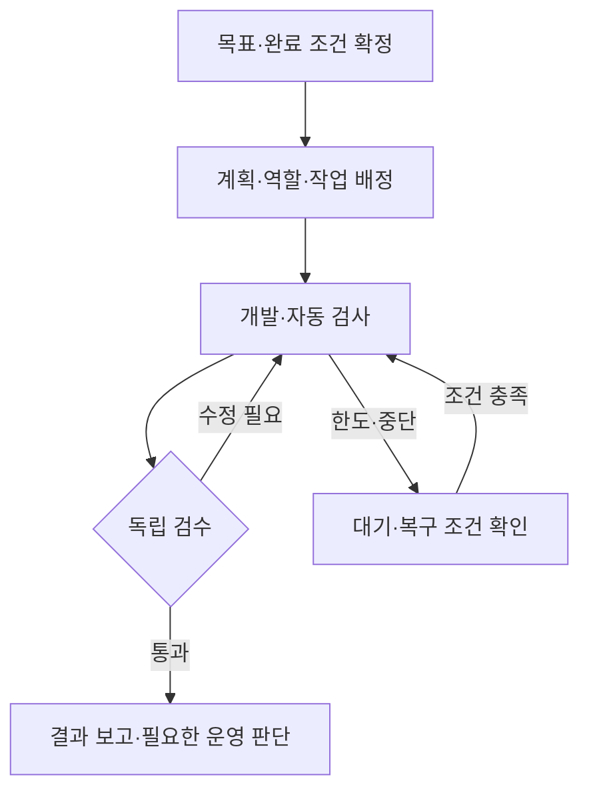

# AI Company 운영·개발 매뉴얼

**목표·역할·작업 흐름과 복구 원칙을 찾는 기준 문서입니다.** 변하는 진행 상황은 [현재 현황](index.md) 한 곳에서 확인하고, 과거 판단과 검수 원문은 고정 기록으로 보존합니다.

기준일: 2026-09-29 KST · 문서 초판  
이 문서는 확인된 설계·정책·검증 기록을 정리한 것입니다. 모든 기능이 운영에서 검증됐다는 뜻은 아닙니다. 현재 서버를 직접 조회한 문서도 아닙니다.

## 목차

1. [목표와 완료 조건](#1-목표와-완료-조건)
2. [시스템 구성과 책임](#2-시스템-구성과-책임)
3. [전체 작업 흐름](#3-전체-작업-흐름)
4. [개발·검수·적용 절차](#4-개발검수적용-절차)
5. [세션과 인계](#5-세션과-인계)
6. [대기·중단·복구](#6-대기중단복구)
7. [작업 효율과 병렬화](#7-작업-효율과-병렬화)
8. [문서·근거·접근 정보](#8-문서근거접근-정보)

## 1. 목표와 완료 조건

사용자는 PM과 목표·완료 조건을 정합니다. 개발·검사·독립 검수·수정·최종 보고가 그 조건에 맞춰 이어지도록 하네스와 작업 루프를 구축합니다. 역할과 실행 도구를 분리해 다른 어댑터를 추가할 수 있게 합니다.

| 확인 단계 | 무엇이 확인됐다는 뜻인가 |
| --- | --- |
| 구현 | 해당 후보에 코드·설정·화면이 존재함 |
| 자동 검사 | 지정된 검사·CI의 조건을 통과함 |
| 독립 검수 | 정확한 후보와 범위를 별도 검수자가 확인함 |
| 설치 | 지정한 후보가 목표 경로에 적용되고 대조됨 |
| 실제 흐름 검증 | 사용자 입력부터 결과까지 실제 실행 경로가 이어짐 |
| 운영 전환 | 대상·범위에 맞는 승인과 배포 검증을 마침 |

앞 단계가 끝났다고 다음 단계를 자동 완료로 표시하지 않습니다. 현재 수준은 [현황의 후보별 확인 수준](index.md#후보별-확인-수준)을 따릅니다.

## 2. 시스템 구성과 책임

| 구성 | 책임 | 공식 사실의 위치 |
| --- | --- | --- |
| 사용자 | 목표·완료 조건·범위와 필요한 운영 판단 | 사용자 지시·승인 원문 |
| Work PM·문서 | 요구사항·수용 기준·검토 결과와 다음 작업 정리 | Git 명세·고정 검수 기록 |
| 서버 개발 세션 | 허용된 범위의 조사·구현·검사·지적 수정·제출 | 작업 브랜치·검사 결과·인계 |
| 제품 PM·작업 루프 | 목표와 계획을 역할·작업·검사·재작업으로 연결 | 제품의 계획·작업·체크포인트 |
| CLI 어댑터·실행 공간 | 선택한 도구를 실행하고 산출물·결과를 수집 | 실행 기록·작업 공간 |
| 공유 호출 장부 | 예약·소유권·사용량·계정 제한·정산 관리 | 비공개 장부와 실행 증거 |
| 독립 검수자 | 고정 후보의 범위·지적·판정 확인 | 대상 HEAD·패치·검수 원문 |
| 웹 작업실 | 목표·진행·결정·결과를 사용자에게 표시 | 원천 상태를 연결한 화면 |

이 표는 책임 관계입니다. 제품의 전체 흐름이 현재 운영에서 완료됐다는 표시가 아닙니다. 웹 대화와 서버 CLI 사이에 자동 세션 승계가 있다고 가정하지 않습니다.

검수 역할은 세 가지를 구분합니다. 서버 PR 완료 전 별도 Claude 검수, 제품의 Astra 최종 검수, Work PM의 수용 검토는 서로 대체되지 않습니다. 모델·설정·실제 적용 증거는 각 실행 기록에서 확인합니다.

## 3. 전체 작업 흐름

이는 목표 흐름을 요약한 도식입니다. 구체적인 재개는 원래 실행의 종료·정산·소유권·중복 방지 조건을 따릅니다. 도식의 화살표가 자동 재시도 권한을 만들지는 않습니다.

현재 확인된 범위와 실제 사용자가 끝까지 수행해야 할 검증은 [전체 구축 단계](index.md#전체-구축-단계)에 분리합니다.

## 4. 개발·검수·적용 절차

1. 현재 목표·완료 조건·허용 범위와 기준 코드·문서 커밋을 고정합니다. 필요한 지침과 미해결 항목부터 읽습니다.
2. 한 완료 목표의 관련 조사·구현·검사·수정·문서화·패키징을 묶습니다. 승인된 범위에서 파일마다 재확인을 받지 않습니다.
3. 변경 위험에 맞는 관련 검사부터 실행하고 안정화한 최종 후보에 필요한 전체 검사·CI를 수행합니다. 코드와 위험이 같으면 검사를 반복하지 않습니다.
4. 필수 독립 Claude 검수는 [공통 완료 조건](https://github.com/HyungwonPark/ai-company/blob/9d444112bf0a23c3d7eaedb8c8893ed2084bb698/docs/work-reviews/pr-completion-review-policy.md)에 따라 정확한 HEAD·base·전체 패치를 대상으로 실행합니다. 지적 수정 뒤에는 새 후보를 확인합니다.
5. 결과를 Work PM 수용 검토에 제출합니다. 구현·CI·실제 검수·미검토 범위·설치 여부를 분리해 보고합니다.
6. 운영 변경은 검토 가능한 대상·해시·영향·적용/복구안을 준비한 뒤 기존 승인 범위와 대조합니다. 같은 범위가 이미 승인됐다면 재승인을 추가하지 않습니다.

신뢰 검수기는 저장소 밖에 설치한 고정본을 사용합니다. 후보 PR이 검수기 복사본을 자동 교체하지 않습니다. 실제 호출이 제한·UNKNOWN으로 막히면 그 이유와 재개 조건을 남기고 검수 대기로 표시합니다. 문서 수용이나 모의 검사로 실제 Claude PASS를 대신하지 않습니다.

### 각 작업의 보고 항목

| 항목 | 기록할 내용 |
| --- | --- |
| 목표·범위 | 무엇을 끝내려 했고 어디까지 허용됐는가 |
| 후보 | PR·HEAD·base, 필요한 패치·패키지 해시 |
| 변경 | 무엇이 바뀌었고 어떤 문제가 해결되는가 |
| 검증 | 검사·CI·독립 검수·실제 실행 각각의 결과 |
| 적용 | 실제 설치 여부, 대조 결과와 복구 위치의 공개 가능한 요약 |
| 미확정 | 아직 모르는 값·미완료 범위·차단 사유 |
| 다음 행동 | 다음 한 묶음, 완료 조건과 필요한 판단 |
| 출처·시각 | 직접 확인·서버 보고·미확인 구분, 해당 관측 시각 |

## 5. 세션과 인계

같은 작업에서는 개발 세션을 활용하고 목표·공식 상태는 세션 밖에 보존합니다. 기존 CLI의 도구와 작업 공간을 재사용하는 실용성은 있지만 세션 기록이 자동 RAG가 되거나 토큰 절약을 보장하지는 않습니다.

| 대상 | 원칙 |
| --- | --- |
| 개발 대화 | 같은 목표는 유지하고 목표가 바뀌면 짧은 인계를 거쳐 새 대화를 고려 |
| 제품 실행 세션 | 장부·체크포인트·소유권·종료 확인을 따라 처리 |
| 전용 PR 검수 | 고정 대상·전용 실행 기록·중복 방지와 승인된 재개 절차 유지 |

인계에는 목표, 코드와 미커밋 변경 위치, 완료 근거, 미해결 항목, 실행·예약 상태, 승인 범위, 다음 행동과 원천 기록을 남깁니다. 원문을 삭제하거나 요약으로 덮어쓰지 않습니다. 단순 프로세스 재시작과 같은 대화 resume를 토큰 절약으로 계산하지 않습니다.

상세 기준: [CLI 세션 유지·전환 명세](https://github.com/HyungwonPark/ai-company/blob/9d444112bf0a23c3d7eaedb8c8893ed2084bb698/docs/work-reviews/cli-session-lifecycle-policy-2026-09-28.md). 이 문서의 과거 설치 상태는 당시 기록이며, 실제 행동에는 현재 현황에서 연결하는 최신 복구 지시를 우선 대조합니다.

## 6. 대기·중단·복구

| 상황 | 판단 기준 |
| --- | --- |
| 한도 대기 | 실제 공급자 거절·회복 시각·종료·정산 등 지원 경로의 요건 |
| 문맥 부족 | 지원되는 인계·종료 확인과 체크포인트 기반 새 세션 |
| timeout·종료 미확정 | UNKNOWN을 보존하고 실행과 하위 작업의 종료 근거 확인 |
| 종료 확인·비용 미확정 | 부분 관측과 총비용을 구분하고 지원되는 미확정 비용 기록 경로 확인 |
| 계정 복구·후속 호출 | 정산과 별도의 제한 해소·같은 대상 중복 방지 요건 |

현재 설치된 일반 timeout의 지원 범위와 미구현 재시도 조건은 [현재 복구 기록](https://github.com/HyungwonPark/ai-company/blob/9d444112bf0a23c3d7eaedb8c8893ed2084bb698/docs/work-reviews/pr37-applied-timeout-recovery-2026-09-29.md)을 따릅니다. 시간 경과·새 세션·계정 변경·빈 커밋으로 제한을 피하지 않습니다. 이미 충분히 조사한 동일 증거는 새 출처가 없으면 반복 검색하지 않습니다.

운영에서 자주 혼동할 경계는 다음과 같습니다.

- 주 호출 성공과 Workflow·모든 하위 실행 종료는 서로 다른 사실입니다.
- 파일 읽기 관측과 검수 완료 인정은 다릅니다.
- 비용 일부 관측과 총비용 확정은 다릅니다.
- 예약 정산과 계정 해제, 다음 호출 허용은 각각 조건이 있습니다.
- 코드 커밋과 실제 서버 적용을 별도로 확인해야 합니다.
- 개발 대화의 종료와 제품 작업·예약의 종료는 같은 사건이 아닙니다.

## 7. 작업 효율과 병렬화

작은 작업은 개발 역할 하나, 독립 산출물이 있는 작업만 병렬화하는 방향을 정했습니다. 필수 독립 검수는 유지합니다. 이 방향의 현재 제품 반영 여부는 현황에서 확인합니다.

서버 개발의 기본 설정·묶음 단위·검사 범위는 [개발 효율 지침](https://github.com/HyungwonPark/ai-company/blob/9d444112bf0a23c3d7eaedb8c8893ed2084bb698/docs/work-reviews/server-codex-efficiency-policy.md), 후속 제품 변경은 [역할 선택 명세](https://github.com/HyungwonPark/ai-company/blob/9d444112bf0a23c3d7eaedb8c8893ed2084bb698/docs/work-reviews/adaptive-orchestration-policy-2026-09-28.md)를 따릅니다. 개발용 설정을 제품 역할의 모델 설정으로 자동 확대하지 않습니다.

효율은 같은 모델·시작 코드·완료 조건에서 검수 통과 작업 한 건당 비용·시간·재수정·사람의 복구 개입으로 비교합니다. 실패·중단·요약·재조사 비용도 포함하고 미확인 값을 0으로 만들지 않습니다. 측정 전 절약률을 단정하지 않습니다.

## 8. 문서·근거·접근 정보

| 정보 | 보존 위치 |
| --- | --- |
| 현재 진행 상태 | [현황 원본](index.md) |
| 지속되는 절차·책임 | 이 매뉴얼과 연결한 정책 원문 |
| 당시 판단·검수 | 커밋에 고정한 작업 기록 |
| 실행·예약·정산 사실 | 서버 원본·장부·영수증·체크포인트 |
| 인증·계정·운영 원문 | 기존 비공개 관리 위치 |

공개 매뉴얼에는 인증 정보·비공개 식별자·원시 로그·운영 명령의 비밀 인자를 싣지 않습니다. 접근 방법은 실제 기존 로그인·권한을 확인한 뒤 공개 가능한 안내만 적습니다. 같은 도메인의 새 경로라고 기존 인증이 자동 적용된다고 가정하지 않습니다.

일상 확인 링크는 바뀌지 않게 유지하고 승인·검수 근거는 당시 문서 커밋에 고정합니다. 자세한 갱신 절차와 `/review` 배포 후보의 범위는 [고정 주소·갱신 명세](publishing.md)에 있습니다.

[최종 수정일: 2026-09-29, v1.0]
