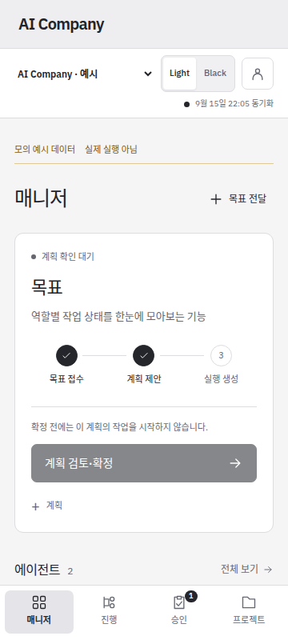
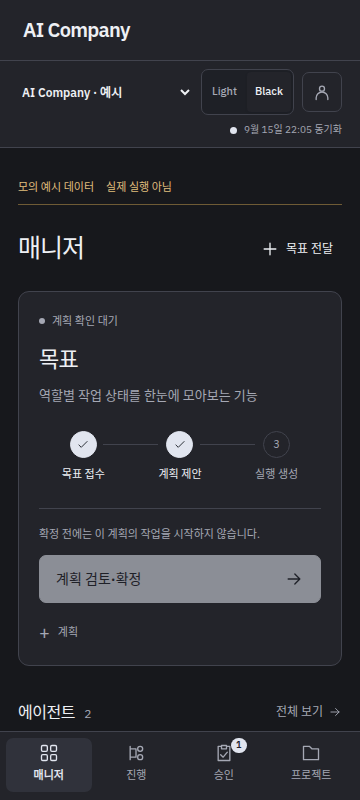

# 화면 제목 정리

문장형 제목을 짧은 항목명으로 바꿨다. 페이지 상단의 중복 설명을 제거하고, 목표·보고서·승인 요청의 원래 제목은 본문에 보존했다. Light·Black 공통 적용이며 공개 서비스 교체는 아직 수행하지 않았다.

| 이전 | 변경 |
|---|---|
| 작업 한눈에 | 매니저 |
| 긴 목표 문장 | 목표 · 내용은 본문 |
| 담당 에이전트 | 에이전트 |
| 확인할 항목 | 알림 |
| PM에게 전달 | 대화 |
| 대화 기록 | 기록 |
| 계획·설정·실행 기록 | 상세 |
| 역할별 진행 | 진행 |
| 프로젝트의 실행 기준 | 프로젝트 |

계획 확정·승인 확인 버튼의 동작, 전체 승인 대상·조건, 원문·번역 출처·요청/관측 설정 구분은 유지한다. 역할명·계획 해시·실행 ID와 저장된 원문을 변경하지 않았다.

| Light | Black |
|---|---|
|  |  |

[Light 전체](assets/manager-labels-2026-09-16/light-mobile-manager-simple.png) · [Black 전체](assets/manager-labels-2026-09-16/black-mobile-manager-simple.png) · [출처·SHA-256](assets/manager-labels-2026-09-16/manifest.json)

캡처는 인증된 격리 테스트 서버의 응답 예시이며 실제 운영 화면이 아니다. 앱 소스는 `131ac551b44716490ff52c33e5cd6c25ebcf8466`, 브라우저 검사 head는 `0f5988e71f8ffe2ffcdb4d000b6f74381d7a1428`이다. 두 커밋 사이에는 검사 선택자 수정만 있다.

- [브라우저 CI](https://github.com/HyungwonPark/ai-company/actions/runs/35029085501): Light·Black, 320/360px, 최초 화면 버튼 위치, 저장·새로고침·로그인·계획 확정·승인·원문 전환·번역 대기 중 탐색 PASS. 매니저 읽기·테마 전환·기록 펼치기는 API 쓰기 0건이다.
- 같은 head의 [Python 회귀](https://github.com/HyungwonPark/ai-company/actions/runs/35029085575), [Android APK 검사](https://github.com/HyungwonPark/ai-company/actions/runs/35029085644), [기존 공개 HTTPS 검사](https://github.com/HyungwonPark/ai-company/actions/runs/35029085472) PASS. APK 실기기 검사나 새 UI 배포 완료를 뜻하지 않는다.
- 첫 검사에서 협업 카드에 남아 있던 이관 문구를 통일했다. 다음 검사에서 짧아진 대화상자 제목과 진행 상태명이 겹쳐, 확인 대상을 실제 진행 단계로 한정했다. 최종 전체 UI 검사는 통과했다.

기존 [미적용 이미지](manager-readable-validation-2026-09-15.md)는 이번 제목 수정을 포함하지 않으므로 이전 후보 기록으로 표시했다. 새 운영 배포·병합·모델 실행·계획 확정을 수행하지 않았고 PR #10 후보 승인은 변경하지 않았다.
